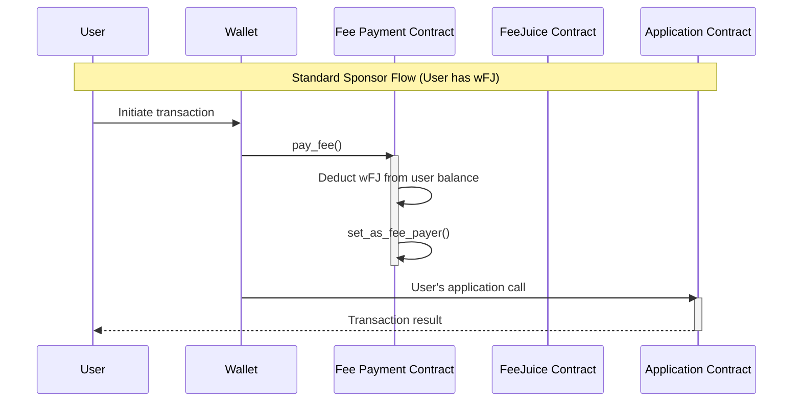
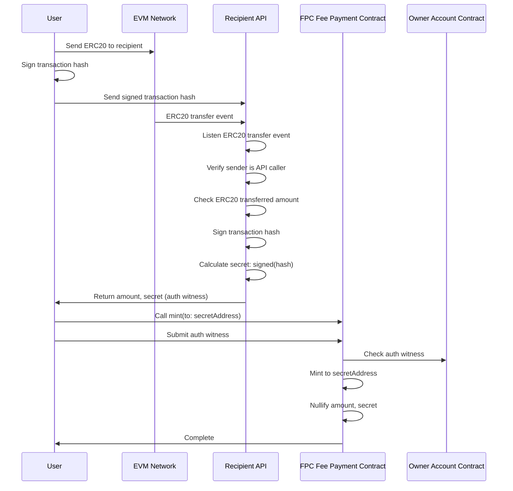

# Fee Payment Contract (FPC) — Product Requirements Document

**Version**: 1.0
**Status**: Draft
**Target Phase**: Production Readiness (Phase 3)
**Audience**: Implementation Engineers
**Date**: February 2026

---

## Problem Statement

Users interacting with Aztec need Fee Juice (FJ) to pay for transaction costs, but acquiring and managing FJ directly creates significant UX friction, especially for non-sophisticated EVM users bridging from L1/L2 chains. Users must understand gas mechanics, bridge AZT tokens, and maintain FJ balances—all of which leak privacy and create cold-start problems (users cannot transact without FJ, but cannot get FJ without transacting).

**Who is affected**: All Aztec users, particularly those onboarding from Ethereum mainnet or L2 chains (Base, Arbitrum, etc.).

**Impact of not solving**: Poor onboarding experience, privacy leakage through direct FJ management, high barrier to entry for non-crypto-native users.

---

## Goals

1. **Enable gasless UX**: Users interact with Aztec without directly managing Fee Juice—they use internal balance (wFJ) that abstracts gas mechanics
2. **Preserve privacy**: Shared FPC increases anonymity set; users don't expose their Aztec address when topping up
3. **Minimize proving time**: Minimal gates overhead (sponsor with BalanceNote), prioritize lean transaction flows
4. **Support cold-start**: Users with zero FJ can claim and sponsor transactions atomically

---

## Non-Goals

1. **Zero-trust for L2→Aztec flow**: The trusted path accepts SP (Service Provider) trust for balance distribution.
2. **Zero-sum FJ accounting**: Dust accumulation in FPC is acceptable. We will NOT track perfect invariant `FPC.FJ_balance == FPC.wFJ_total_supply` for non-exact flows.
3. **Pay-per-use model**: Top-up is preferred over per-transaction payments due to privacy implications and SP online requirements.
4. **USD payments within Aztec**: Quote oracles on Aztec add significant gate overhead. Token→AZT conversion happens on EVM.

---

## User Stories

### Service Provider (SP) / FPC Owner

**As an SP, I want to fund the FPC with Fee Juice so that users can sponsor their transactions.**

- Bridge AZT from L1 to Aztec
- Claim FJ from Fee Juice Portal into FPC
- Use own AccountContract to pay for claim transaction (self-sponsoring)

**As an SP, I want to authorize users to mint wFJ so that I can monetize fee sponsorship.**

- Process user payment on EVM (L1/L2)
- Generate authwit for `mint(AztecAddress, amount)`
- Distribute authwit to user off-chain

### End User (L2→Aztec Trusted Flow)

**As a user paying on Base/Arbitrum, I want to top up my Aztec fee balance without bridging.**

- Pay FJ on L2 to SP's contract (via swapping on-chain or transfer)
- Off-chain script validates payment and generates authwit
- Mint wFJ to my Aztec address using authwit
- Use wFJ to sponsor subsequent transactions

**As a user, I want to see my remaining fee balance before transacting.**

- FPC JS provides `getBalance()` in FJ units
- Wallet displays balance and warns on low balance
- Wallet automatically triggers "mint and sponsor" if balance insufficient

## Requirements

### P0 — Must Have

### Noir Contract: Metered FPC

| Requirement | Acceptance Criteria |
| --- | --- |
| **Storage: User balance tracking** | `BalanceSet<Context>` maps `AztecAddress → wFJ balance`; uses `UintNote` for private balance |
| **Storage: Owner address** | `PublicImmutable<AztecAddress>` for SP authorization |
| **Method: `pay_fee()`** | Deducts gas cost from caller's wFJ balance; calls `set_as_fee_payer` |
| **Method: `mint(amount, secret)`** | Privacy-preserving self-sponsoring with **stateless SP** and **custom authwit** (no caller binding): SP generates `secret = SP.sign(txHash)` deterministically; authwit authorizes `(amount, secret)`; mints to `msg_sender`; SP never learns Aztec address; same txHash = same response |
| **Authorization pattern** | Uses custom `assert_valid_autwhit` for mint operations |

### Off-chain Service (Trusted Flow)

| Requirement | Acceptance Criteria |
| --- | --- |
| **Payment processor** | Accepts ERC20 payment on EVM; validates amount on off-chain service |
| **Authwit generator** | Generates `mint(AztecAddress, amount)` authwit signed by Owner |
| **Atomic pull/sign** | Smart contract enforces authwit submission when pulling user funds |
| **Rate limiting** | Protects against abuse; configurable per-user limits |

### P1 — Nice to Have

Script for FPC fill-up of fee juice that automatically fills up the FPC when close to being depleted.

---

## Technical Architecture

### Contract Initialization & Ownership

**Deployment Flow**:

1. SP deploys FPC contract with `initialize(owner: AztecAddress)`
2. Owner address stored in `PublicImmutable<AztecAddress>`
3. Owner cannot be changed post-initialization

**Owner funds the FPC**:

- Owner fund FPC with Fee Juice through L1→Aztec

**Contract Interaction Diagram**



---

## Deep Dive: Authorization Witnesses for `mint()`

This section provides the technical specification for how the `mint(to, amount)` method is authorized using Aztec's authwit system. Understanding this is critical as it forms the security foundation of the FPC.

### The Cold-Start Problem

**Problem**: User wants to call `mint()` to get wFJ, but they have no FJ to pay for the `mint()` transaction itself. This is a chicken-and-egg problem.

**Solution**: The FPC **self-sponsors** the mint transaction:

1. FPC calls `context.set_as_fee_payer()` to pay for the transaction
2. FPC deducts the transaction's gas cost from the amount being minted
3. User receives `(requested_amount - tx_gas_cost)` as wFJ

### Preventing double-spend

**Secret tracking via nullifiers**: Instead of public storage for secret, we use nullifiers. Each `(to, secret)` pair generates a unique nullifier. If the same pair is used twice, the nullifier already exists and the transaction fails.

### ⚠️ Critical: Griefing Attack Prevention

**The Problem**: If we push the nullifier AFTER calling `set_as_fee_payer()`, an attacker can grief the FPC:

1. Attacker gets valid authwit, submits tx (succeeds, nullifier added)
2. Attacker submits SAME tx again
3. Private execution runs → FPC commits to pay via `set_as_fee_payer()`
4. Sequencer processes → nullifier exists → tx fails
5. **FPC loses gas, attacker pays nothing**

**The Solution**: Push the nullifier BEFORE committing to pay. This will revert in the case that it was already pushed

```jsx
┌────────────────────────────────────────────────────────────────────────────┐
│                    GRIEFING ATTACK PREVENTION                              │
├────────────────────────────────────────────────────────────────────────────┤
│                                                                            │
│  BEFORE (Vulnerable):                                                      │
│  ┌─────────────────────────────────────────────────────────────────────┐   │
│  │ 1. validate authwit                                                 │   │
│  │ 2. set_as_fee_payer() ← FPC COMMITS HERE                            │   │
│  │ 3. end_setup()                                                      │   │
│  │ 4. push_nullifier()   ← Check too late! Already committed to pay    │   │
│  └─────────────────────────────────────────────────────────────────────┘   │
│                                                                            │
│  AFTER (Secure):                                                           │
│  ┌─────────────────────────────────────────────────────────────────────┐   │
│  │ 1. validate authwit                                                 │   │
│  │ 2. validate amount                                                  │   │
│  │ 3. push_nullifier() ← FAILS if secret already used                  │   │
│  │ 4. set_as_fee_payer() ← FPC commits ONLY after validation           │   │
│  │ 5. end_setup()                                                      │   │
│  └─────────────────────────────────────────────────────────────────────┘   │
└────────────────────────────────────────────────────────────────────────────┘
```

### Mint authorization API (L2→Aztec Trusted Flow)

This section specifies how users obtain authwits from the Service Provider (Aztec Labs) after paying on EVM.

### EVM-Side Payment Flow

```jsx
┌──────────────────────────────────────────────────────────────────────────────┐
│                     USER PAYMENT FLOW ON EVM                                 │
├──────────────────────────────────────────────────────────────────────────────┤
│                                                                              │
│  1. SWAP: User swaps tokens → Fee Juice on DEX                               │
│     ┌────────────────────────────────────────────────────────────────-────┐  │
│     │ User: 100 USDC                                                      │  │
│     │          │                                                          │  │
│     │          ▼                                                          │  │
│     │ Uniswap / 1inch: USDC → FJ swap                                     │  │
│     │          │                                                          │  │
│     │          ▼                                                          │  │
│     │ User: ~1000 AZT (rate determined by DEX)                            │  │
│     └─────────────────────────────────────────────────────────────-───────┘  │
│                                      │                                       │
│                                      ▼                                       │
│  2. TRANSFER: DEX sends Fee Juice to Aztec Labs address                      │
│     ┌────────────────────────────────────────────────────────────-────────┐  │
│     │ DEX → AztecLabsFeeCollector: transfer(1000 FJ)                      │  │
│     │                                                                     │  │
│     │ Transaction produces: txHash = 0xabc123...                          │  │
│     │ This txHash becomes the NONCE for the authwit                       │  │
│     └────────────────────────────────────────────────────────────-────────┘  │
│                                      │                                       │
│                                      ▼                                       │
│  3. REQUEST: User requests authwit from SP API (pull-based)                  │
│     ┌──────────────────────────────────────────────────────────────-──────┐  │
│     │ User signs EIP-712 message proving ownership                        │  │
│     │ User calls: POST /api/v1/authwit/request                            │  │
│     │ SP verifies signature + txHash + returns authwit                    │  │
│     └───────────────────────────────────────────────────────────-─────────┘  │
│                                                                              │
└──────────────────────────────────────────────────────────────────────────────┘
```

### EIP-712 Typed Data Specification

User signs the txHash to prove they control the EVM address that made the payment.

```tsx
// EIP-712 Domain
const domain = {
  name: 'Aztec FPC Claim',
  version: '1',
  chainId: 8453,  // EVM chain where payment was made (Base, Ethereum, etc.)
};

// EIP-712 Types - JUST the txHash
const types = {
  ClaimRequest: [
    { name: 'txHash', type: 'bytes32' },  // Payment transaction hash
  ],
};

// User signs ONLY the txHash
const message = {
  txHash: '0xabc123...def',  // The FJ transfer txHash
};

// Wallet displays to user:
// ┌─────────────────────────────────────────┐
// │ Aztec FPC Claim Request                 │
// │                                         │
// │ Claim payment: 0xabc123...def           │
// │                                         │
// │ [Sign]  [Reject]                        │
// └─────────────────────────────────────────┘
```

### API Specification

```yaml
POST /api/v1/authwit/request
Content-Type: application/json

Request:
{
  "evmTxHash": "0xabcdef...",   # FJ transfer tx hash (32 bytes hex)
  "evmChainId": 8453,          # Chain where payment was made
  "signature": "0x..."         # EIP-712 signature over txHash (65 bytes)
}

Response (Success - 200):
{
  "amount": "1000000000000000000",  # Total FJ amount (from txHash)
  "secret": "0x789abc...",          # SP.sign(txHash) - DETERMINISTIC per payment
  "authwit": "0x..."                # Owner's authwit for mint(amount, secret)
}

# SP is STATELESS: same txHash always returns same response!
# secret = SP.sign(txHash) is deterministic

# User calls mint() with:
#   - amount (from response)
#   - secret (from response - SP generated it!)
# User also needs the authwit witness for their PXE
# Tokens minted to msg_sender (user's Aztec address, never shared with SP)

Response (Error - 400):
{
  "error": "INVALID_SIGNATURE" | "TX_NOT_FOUND" | "TX_NOT_FINALIZED" |
           "WRONG_RECIPIENT"
}

# Note: No "ALREADY_CLAIMED" error - same txHash returns same response (stateless!)

```

### Backend Verification Logic (STATELESS)

```tsx
HANDLE_AUTHWIT_REQUEST(evmTxHash, evmChainId, signature):

    // 1. VERIFY SIGNATURE
    //    - Recover EVM address from EIP-712 signature
    
    // 2. FETCH & VALIDATE TRANSACTION
    //    - Transaction succeeded
    //    - Transaction is finalized (enough confirmations)
    
    // 3. VALIDATE SENDER
    //    - Signature signer == transaction sender
    //    - Rejects requests from non-payers
    
    // 4. VALIDATE RECIPIENT  
    //    - Transaction recipient == Aztec Labs fee collector
    //    - Rejects payments to wrong address
    
    // 5. PARSE AMOUNT
    //    - Extract AZT amount from transaction
    
    // 6. GENERATE SECRET (DETERMINISTIC)
    //    - secret = SP.sign(txHash)
    //    - Same txHash → same secret, always
    
    // 7. GENERATE AUTHWIT
    //    - Custom authwit for mint(amount, secret)
    
    // 8. RETURN
    //    - { amount, secret, authwit }
    //    - Stateless: same request = same response

```

### Why Stateless?

| Property | Explanation |
| --- | --- |
| **No database** | Same txHash → same secret → same authwit, every time |
| **Idempotent** | User can retry request infinitely, always gets same response |
| **Deterministic secret** | `secret = SP.sign(txHash)` is reproducible |
| **Crash-resilient** | No state to lose, no recovery needed |

### Why This Design?

| Benefit | Explanation |
| --- | --- |
| **Privacy-preserving** | SP never learns user's Aztec address |
| **Stateless SP** | No database, horizontally scalable, crash-resilient |
| **Deterministic** | Same txHash always produces same response |
| **Custom authwit** | No caller binding allows any address to claim |
| **Replay prevention** | Secret is nullified after use on Aztec |

### Pull-Based Retry Mechanism

```jsx
┌──────────────────────────────────────────────────────────────────────────────┐
│                        PULL-BASED RETRY FLOW                                 │
├──────────────────────────────────────────────────────────────────────────────┤
│                                                                              │
│  Scenario: SP is temporarily offline when user requests authwit              │
│                                                                              │
│  Timeline:                                                                   │
│  ─────────────────────────────────────────────────────────────────────────   │
│  T=0:   User transfers FJ to Aztec Labs (txHash recorded on-chain)           │
│  T=1m:  User requests authwit → SP offline → request fails                   │
│  T=2h:  User retries → SP online → authwit returned ✓                        │
│  T=2h:  User submits mint() on Aztec → success ✓                             │
│                                                                              │
│  Why this works:                                                             │
│  • Payment is recorded on EVM chain (immutable)                              │
│  • txHash is permanent proof of payment                                      │
│  • SP can verify payment at any time                                         │
│  • Same txHash always generates same authwit (idempotent)                    │
│  • User funds are never at risk (just delayed access)                        │
│                                                                              │                                                                              │
└──────────────────────────────────────────────────────────────────────────────┘
```

User includes signature as witness when calling `mint()`:

```tsx
// User's PXE stores the authwit witness before sending tx
await userWallet.setAuthWitness(outerHash, signature);

// Now mint() will validate via Owner's AC
await fpc.methods.mint(to, amount, secret).send().wait();

```

### Complete End-to-End Flow Summary

```jsx
┌─────────────────────────────────────────────────────────────────────────────┐
│      COMPLETE MINT FLOW (PRIVACY-PRESERVING + STATELESS SP DESIGN)          │
├─────────────────────────────────────────────────────────────────────────────┤
│                                                                             │
│  1. USER SWAPS ON DEX (e.g., Uniswap on Base)                               │
│     ┌────────────────────────────────────────────────────────────────────┐  │
│     │ User has: 100 USDC on Base                                         │  │
│     │ User → Uniswap: swap(100 USDC → ~1000 FJ)                          │  │
│     │ (Rate determined by DEX liquidity, no oracle needed)               │  │
│     └────────────────────────────────────────────────────────────────────┘  │
│                                      │                                      │
│                                      ▼                                      │
│  2. DEX TRANSFERS FJ TO AZTEC LABS                                          │
│     ┌────────────────────────────────────────────────────────────────────┐  │
│     │ DEX → AztecLabsFeeCollector: transfer(1000 FJ)                     │  │
│     │ Transaction produces: txHash = 0xabc123...def                      │  │
│     └────────────────────────────────────────────────────────────────────┘  │
│                                      │                                      │
│                                      ▼                                      │
│  3. USER REQUESTS AUTHWIT (STATELESS API)                                   │
│     ┌────────────────────────────────────────────────────────────────────┐  │
│     │ User signs EIP-712 message (JUST txHash):                          │  │
│     │   { txHash: 0xabc123...def }                                       │  │
│     │                                                                    │  │
│     │ User → SP API: POST /api/v1/authwit/request                        │  │
│     │   Body: { evmTxHash, evmChainId, signature }                       │  │
│     │                                                                    │  │
│     │ SP verifies:                                                       │  │
│     │   ├─ EIP-712 signature recovers to txHash sender ✓                 │  │
│     │   ├─ txHash shows FJ transfer to AztecLabsFeeCollector ✓           │  │
│     │   └─ txHash is finalized ✓                                         │  │
│     │                                                                    │  │
│     │ SP generates DETERMINISTICALLY:                                    │  │
│     │   ├─ secret = SP.sign(txHash) ← SAME txHash = SAME secret!         │  │
│     │   └─ authwit for mint(amount, secret)                              │  │
│     │                                                                    │  │
│     │ SP returns: { amount, secret, authwit }                            │  │
│     │                                                                    │  │
│     │ ⚠️  SP NEVER SEES: user's Aztec address                            │  │
│     │ ⚠️  SP is STATELESS: same request = same response, always!         │  │
│     │                                                                    │  │
│     │ Note: User can retry infinitely (no database, deterministic)       │  │
│     └────────────────────────────────────────────────────────────────────┘  │
│                                      │                                      │
│                                      ▼                                      │
│  4. USER CALLS MINT ON AZTEC (ALL PRIVATE)                                  │
│     ┌────────────────────────────────────────────────────────────────────┐  │
│     │ User stores authwit witness in PXE                                 │  │
│     │ User → FPC: mint(amount=1000, secret)                              │  │
│     │                                                                    │  │
│     │ FPC.mint() executes ENTIRELY IN PRIVATE:                           │  │
│     │                                                                    │  │
│     │   VALIDATION PHASE (before committing):                            │  │
│     │   ├─ Verify custom authwit                                         │  │
│     │   └─ push_nullifier(amount, secret)                                │  │
│     │                                                                    │  │
│     │   COMMIT PHASE:                                                    │  │
│     │   ├─ context.set_as_fee_payer() → FPC pays gas                     │  │
│     │   └─ context.end_setup()                                           │  │
│     │                                                                    │  │
│     │   EXECUTION PHASE:                                                 │  │
│     │   ├─ Calculate: mintAmount = 1000 - 50 = 950                       │  │
│     │   ├─ to = context.msg_sender()                                     │  │
│     │   ├─ Create UintNote(950, to)                                      │  │
│     │   └─ Emit encrypted note to caller                                 │  │
│     │                                                                    │  │
│     │ Protocol (fee settlement):                                         │  │
│     │   └─ Deducts actual_fee (≤50) from FPC.FJ_balance                  │  │
│     └────────────────────────────────────────────────────────────────────┘  │
│                                      │                                      │
│                                      ▼                                      │
│  5. RESULT                                                                  │
│     ┌────────────────────────────────────────────────────────────────────┐  │
│     │ User started with: 0 FJ on Aztec, 0 wFJ                            │  │
│     │ User now has: 0 FJ on Aztec, 950 wFJ                               │  │
│     │ User can sponsor future transactions with 950 wFJ balance          │  │
│     │                                                                    │  │
│     │ FPC accounting:                                                    │  │
│     │   - FJ_balance decreased by actual_fee                             │  │
│     │   - Nullifier tree has hash(FPC, secret) → secret consumed         │  │
│     │   - Caller's private balance increased by 950 wFJ                  │  │
│     │                                                                    │  │
│     │ Privacy properties:                                                │  │
│     │   - SP only saw: txHash, EVM sender                                │  │
│     │   - SP NEVER saw: user's Aztec address                             │  │
│     │   - No link between EVM identity and Aztec identity                │  │
│     │   - Observer sees: nullifier hash, FPC paid fee                    │  │
│     │   - Observer does NOT see: recipient, amount, secret               │  │
│     │                                                                    │  │
│     │ Stateless properties:                                              │  │
│     │   - SP has no database                                             │  │
│     │   - secret = SP.sign(txHash) is deterministic                      │  │
│     │   - Same request = same response, always                           │  │
│     │   - Horizontally scalable, crash-resilient                         │  │
│     │                                                                    │  │
│     │ Security properties:                                               │  │
│     │   - Same secret cannot be used twice (nullifier prevents replay)   │  │
│     │   - Only txHash sender can get authwit (EIP-712 verification)      │  │
│     │   - Custom authwit has no caller binding (any address can claim)   │  │
│     │   - SP offline? Retry later (deterministic, no state to lose)      │  │
│     └────────────────────────────────────────────────────────────────────┘  │
│                                                                             │
└─────────────────────────────────────────────────────────────────────────────┘

```

### Security Considerations for `mint()`

1. **SP signing key security**: SP signing key generates deterministic secrets. Compromise allows minting of wFJ.
2. **Recipient privacy**: `caller` is NOT in the authwit—tokens mint to `msg_sender`. SP never learns Aztec address.
3. **Secret determinism**: `secret = SP.sign(txHash)` is deterministic. Same txHash = same secret = same authwit.
4. **Replay prevention**: Secret is nullified after use. Same secret cannot mint twice.
5. **Custom authwit**: Modified authwit skips caller in inner_hash. Allows any address to claim.
6. **No revocation**: Once authwit is generated, it's valid until secret is used. Stateless means no revocation possible.
7. **EIP-712 verification**: SP verifies signature recovers to txHash sender. Proves ownership of payment.
8. **Stateless availability**: SP has no database. User can retry infinitely—deterministic response.
9. **Cross-chain replay prevention**: EIP-712 domain includes EVM `chainId`. Different chains = different signatures.

---

## Test Coverage Matrix

### Authorization Test Cases

| Test Case | Expected Result |
| --- | --- |
| User calls `mint()` without authwit | Revert: "Unauthorized" |
| User calls `mint()` with spent secret | Revert: "Secret already used" |
| User calls `mint()` with wrong amount | Revert: "Invalid authwit" |
| User calls `pay_fee()` with insufficient balance | Revert: "Balance too low" |

### Balance Invariant Tests

| Invariant | Assertion |
| --- | --- |
| Post-mint balance | `user.wFJ_balance == old_balance + minted_amount` |
| Post-sponsor balance | `user.wFJ_balance == old_balance - fee_spent` |
| Post-exact-refund balance | `user.wFJ_balance == old_balance - actual_fee` |

@wei3erHase 



<aside>
🧠

# Design Properties

**1. Stateless**

- **No API state**: Verification uses on-chain events + cryptographic signatures
- **Nullification-based deduplication**: FPC nullifies `(amount, secret)` pairs, preventing double-spend without API tracking
- **Event-driven**: API verifies ERC20 transfer on-demand when user submits signed tx hash

**2. Deterministic**

- **Deterministic secret**: `secret = sign(tx_hash)` - same inputs always produce same output
- **Deterministic auth witness**: `(amount, secret)` where `amount` from event, `secret` from deterministic signature
- **No randomness**: Same ERC20 tx always produces identical auth witness

**3. Private**

- **Private minting**: `mint(to: secretAddress)` is private - recipient not publicly visible
- **Secret-based addressing**: `secretAddress` derived from `secret`, breaking public link between EVM tx and Aztec address
- **No public linkage**: EVM transfer and Aztec mint not linkable in public data

**4. Replayable**

- **Idempotent API**: Same signed tx hash always returns same `(amount, secret)`
- **Persistent events**: EVM events permanent - API can verify after downtime
- **Reusable until nullified**: Auth witness regenerable until FPC nullifies it on successful mint
- **Retry-friendly**: Failed FPC tx allows retry with same auth witness (nullification only on success)

**5. Upgradeable (EVM Side)**

- **Event abstraction**: API listens generically - event structure is implementation detail
- **Format independence**: Auth witness `(amount, secret)` works with any event type
- **FPC unchanged**: FPC contract unchanged regardless of source event
- **Upgrade paths**: Replace ERC20 with any contract event; support multiple events/chains; update verification logic independently

**Implementation**

**Auth Witness**: `(amount: u128, secret: Fr)` where `secret = sign(tx_hash)`

**Nullification**: FPC nullifies `(amount, secret)` after successful mint via Aztec note system.

**Verification**: FPC checks with Owner Account Contract that `secret` is valid signature, `amount` matches, and pair not nullified.

</aside>

<aside>
⚠️

Because we’re using naïve ERC20 transfers, the User cannot send more information to AztecLabs that’s binded to the transaction. When the User claims the wFJ on Aztec, AztecLabs can detect the nullifier, hence know “the User has claimed”, although they won’t know which AztecAddress claimed.

In order to provide more privacy to the user, the EVM side can be replaced: instead of `Transfer(from,to,amount)` a custom event can be implemented on a custom contract (perhaps allowing User to pay in ETH then swap for AZT), i.e. `AZTReceived(amount,userSecretHash)`, on Aztec-side, the User will provide the `userSecretHash` pre-image that will be nullified, making it impossible for AztecLabs to detect which nullifier corresponds to which request.

This flow isn’t “throw your computer to the water” compatible (as the user needs to remember the secret pre-image).

In order to avoid changing the FPC, we can assume all ERC20 transfers to come with a `zero` pre-image for `userSecretHash`, so that when we adopt another EVM flow, the Aztec-side contracts are fully compatible (avoiding any kind of FPC migration or fragmentation).

**Phase 1**: naïve ERC20 transfers, zero secret preimage

**Phase 2:** custom EVM contract (+ EVM functionality), user-selected secret preimage

</aside>