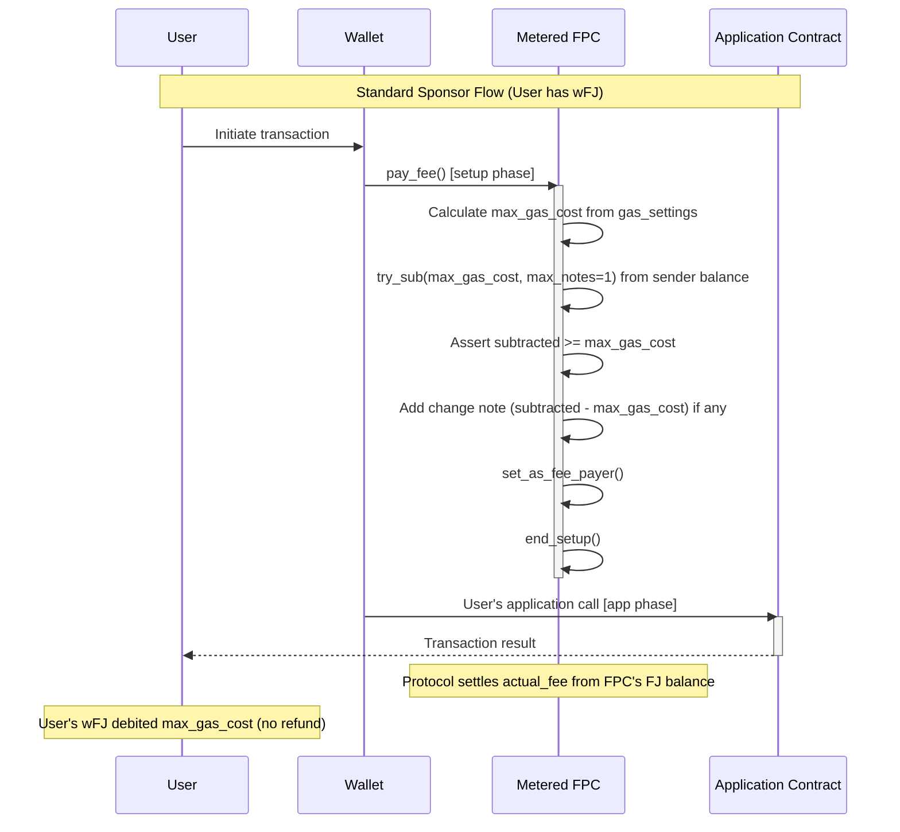
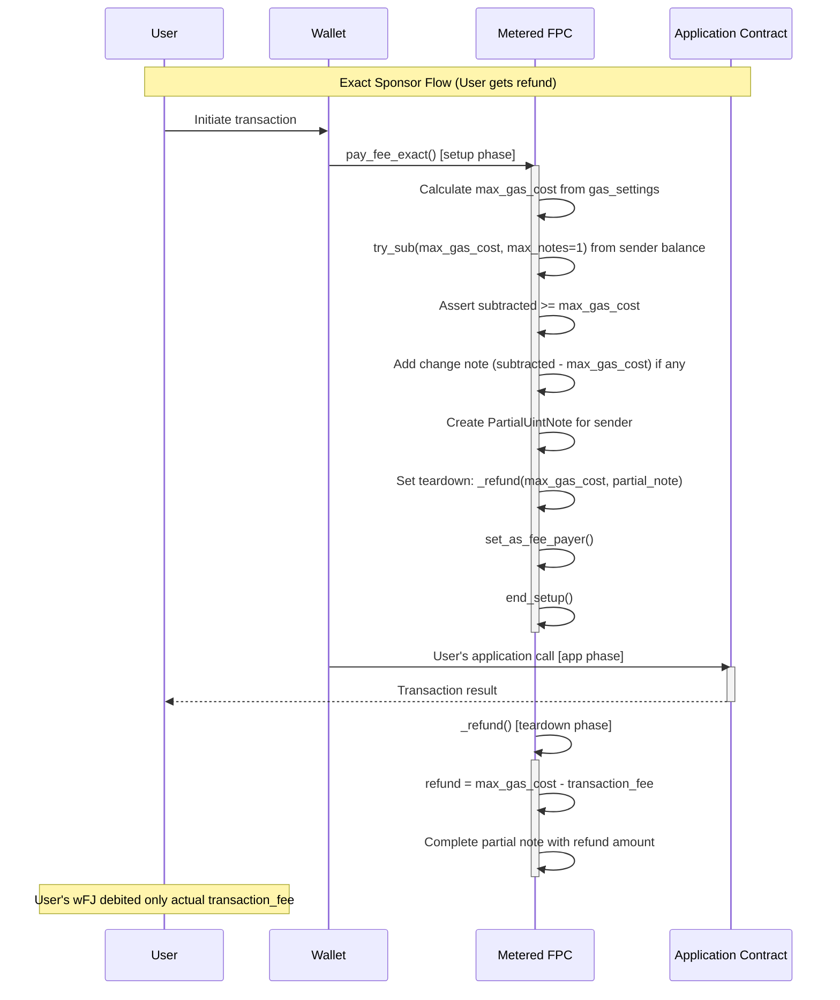
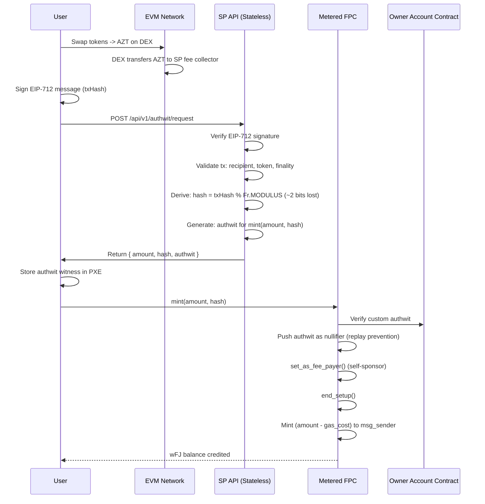

# Fee Payment Contract (FPC) — Product Requirements Document

**Version**: 3.0
**Status**: Active
**Current Phase**: Phase 2 (Authorized Mint with Authwit)
**Target Aztec Version**: 3.0.0-devnet.6-patch.1
**Audience**: Implementation Engineers
**Date**: February 2026

---

## Problem Statement

Users interacting with Aztec need Fee Juice (FJ) to pay for transaction costs, but acquiring and managing FJ directly creates significant UX friction, especially for non-sophisticated EVM users bridging from L1/L2 chains. Users must understand gas mechanics, bridge AZT tokens, and maintain FJ balances—all of which leak privacy and create cold-start problems (users cannot transact without FJ, but cannot get FJ without transacting).

**Who is affected**: All Aztec users, particularly those onboarding from Ethereum mainnet or L2 chains (Base, Arbitrum, etc.).

**Impact of not solving**: Poor onboarding experience, privacy leakage through direct FJ management, high barrier to entry for non-crypto-native users.

---

## Goals

1. **Enable gasless UX**: Users interact with Aztec without directly managing Fee Juice—they use internal balance (wFJ) that abstracts gas mechanics
2. **Preserve privacy**: Shared FPC increases anonymity set; users don't expose their Aztec address when topping up
3. **Minimize proving time**: Minimal gates overhead (sponsor with BalanceNote), prioritize lean transaction flows
4. **Support cold-start**: Users with zero FJ can claim and sponsor transactions atomically

---

## Non-Goals

1. **Zero-trust for L2->Aztec flow**: The trusted path accepts SP (Service Provider) trust for balance distribution.
2. **Zero-sum FJ accounting**: Dust accumulation in FPC is acceptable. We will NOT track perfect invariant `FPC.FJ_balance == FPC.wFJ_total_supply` for non-exact flows.
3. **Pay-per-use model**: Top-up is preferred over per-transaction payments due to privacy implications and SP online requirements.
4. **USD payments within Aztec**: Quote oracles on Aztec add significant gate overhead. Token->AZT conversion happens on EVM.

---

## User Stories

### Service Provider (SP) / FPC Deployer

**As an SP, I want to fund the FPC with Fee Juice so that users can sponsor their transactions.**

- Deploy FPC contract (no initialization parameters required)
- Bridge AZT from L1 to Aztec
- Claim FJ from Fee Juice Portal into FPC
- Use own AccountContract to pay for claim transaction

**As an SP, I want to provide balance to users so they can sponsor transactions.**

- Run a stateless off-chain agent that verifies EVM payments and returns `{ amount, hash, authwit }` to users
- Users call `mint(amount, hash)` on Aztec themselves — SP never learns their Aztec address
- Agent is deterministic and horizontally scalable (no database required)

### End User

**As a user with wFJ balance, I want to sponsor my transactions without managing Fee Juice directly.**

- Use `MeteredFeePaymentMethod` for simple fee payment (max gas cost deducted, no refund)
- Use `MeteredExactFeePaymentMethod` for exact fee payment (refund of unused gas in teardown)
- FPC pays the actual transaction fee from its FJ balance

**As a user, I want to check my remaining fee balance before transacting.**

- Call `balance_of(account)` unconstrained view to query wFJ balance
- Balance is denominated in FJ units

---

## Requirements

### P0 — Must Have

### Noir Contract: Metered FPC

| Requirement | Acceptance Criteria | Status |
| --- | --- | --- |
| **Storage: User balance tracking** | `Owned<BalanceSet<Context>, Context>` maps `AztecAddress -> wFJ balance`; uses `UintNote` for private balance notes | Implemented |
| **Method: `pay_fee()`** | Private, `#[nophasecheck]`. Deducts max gas cost from `msg_sender`'s wFJ balance using `try_sub` with `max_notes = 1`; handles change notes with `UNCONSTRAINED_ONCHAIN` delivery; calls `set_as_fee_payer()` then `end_setup()`. No refund of unused gas. | Implemented |
| **Method: `pay_fee_exact()`** | Private, `#[nophasecheck]`. Deducts max gas cost upfront using same single-note optimization with `UNCONSTRAINED_ONCHAIN` delivery for change notes; creates `PartialUintNote` for refund; sets teardown to call `_refund()`; calls `set_as_fee_payer()` then `end_setup()`. Refunds `max_gas_cost - transaction_fee` in teardown. | Implemented |
| **Method: `mint(amount, hash)`** | Private. `hash` is the EVM txHash reduced to a BN254 field element (`txHash % Fr.MODULUS`, losing ~2 bits from the 256-bit txHash). Validates custom authwit signed by owner, pushes the authwit itself as a nullifier for replay prevention, calls `set_as_fee_payer()` to self-sponsor the mint transaction, deducts gas cost from minted amount, credits `(amount - gas_cost)` to `msg_sender`'s balance. SP never learns user's Aztec address. | Planned |
| **Method: `mint(account, amount)` (legacy)** | Private. Adds `amount` to `account`'s balance via `BalanceSet.add()` with `CONSTRAINED_ONCHAIN` delivery. Permissionless, no access control. | Implemented (Phase 1 — to be replaced) |
| **Method: `_refund(max_gas_cost, partial_note)`** | Public, `#[only_self]`. Teardown function called by `pay_fee_exact()`. Calculates `refund_amount = max_gas_cost - transaction_fee` and completes the partial note. | Implemented |
| **Method: `balance_of(account)`** | Unconstrained utility view. Returns the wFJ balance of an account. | Implemented |
| **Library: `get_max_gas_cost(context)`** | `#[contract_library_method]`. Calculates max gas cost from transaction gas settings: `(DA limit + DA teardown) * max_fee_per_da_gas + (L2 limit + L2 teardown) * max_fee_per_l2_gas`. | Implemented |

> **Note on `mint()` transition**: The contract currently implements `mint(account, amount)` (Phase 1, permissionless) for testing. This is being replaced by `mint(amount, hash)` (Phase 2) which adds custom authwit authorization, replay prevention (the authwit itself is pushed as a nullifier), and self-sponsoring. The `hash` parameter is the EVM txHash reduced to a BN254 field element (`txHash % Fr.MODULUS`, ~2 bits lost). The off-chain agent already implements the Phase 2 flow (see [Phase 2](#phase-2--authorized-mint-with-custom-authwit) and the Off-Chain Agent Specification). The contract update is planned.

### TypeScript SDK

| Requirement | Acceptance Criteria | Status |
| --- | --- | --- |
| **`MeteredFeePaymentMethod`** | Implements `FeePaymentMethod` interface. Calls `pay_fee()` on the FPC in setup phase. No refund of unused gas. | Implemented |
| **`MeteredExactFeePaymentMethod`** | Implements `FeePaymentMethod` interface. Calls `pay_fee_exact()` on the FPC in setup phase. Refunds unused gas via teardown. | Implemented |
| **`deployMeteredContract(wallet)`** | Utility to deploy a Metered FPC contract. Returns `MeteredContract` instance. | Implemented |
| **`maxFeesPerGasFromBaseFees(baseFees, multiplier)`** | Calculates max fees per gas from current base fees with a safety multiplier (default 3x). Returns `GasFees`. | Implemented |
| **`maxGasCostFor(maxFeesPerGas, gasLimits, teardownGasLimits)`** | Calculates maximum possible gas cost in wei. Formula matches the Noir `get_max_gas_cost()` implementation. | Implemented |
| **`REASONABLE_GAS_LIMITS` / `REASONABLE_TEARDOWN_GAS_LIMITS`** | Default gas limit constants sourced from `@aztec/constants`. | Implemented |
| **Contract artifacts** | Generated `MeteredContract`, `MeteredContractArtifact`, and `CounterContract` TypeScript bindings from compiled Noir. Public API exports: `MeteredContract` and `MeteredContractArtifact`. `CounterContract`/`CounterContractArtifact` are test-only (not re-exported from main index). | Implemented |

### Off-chain Service (Trusted Flow)

| Requirement | Acceptance Criteria | Status |
| --- | --- | --- |
| **Payment verification** | Off-chain agent verifies EVM transactions on-demand (stateless); validates AZT transfer to fee collector, checks finality, filters by recipient address AND AZT token address | Implemented (Agent) |
| **Authwit generation** | On verified AZT payment, agent generates deterministic `{ amount, hash, authwit }` and returns to user; user calls `mint(amount, hash)` on Aztec themselves | Implemented (Agent) |
| **AZT-only acceptance** | Agent only processes AZT token transfers (not arbitrary ERC20s) to the designated fee collector address | Implemented (Agent) |
| **Stateless API** | `POST /api/v1/authwit/request` endpoint; same request always returns same response; no database required | Implemented (Agent) |
| **Agent configuration** | `FPC_ADDRESS` (deployed FPC contract address) and `OWNER_ADDRESS` (authwit signer) configured via environment variables; FPC deployed separately | Implemented (Agent) |

### P1 — Nice to Have

- Script for FPC fill-up of fee juice that automatically refills the FPC when close to being depleted.
- TypeScript `getBalance()` convenience wrapper that calls `balance_of()` and returns the result.

---

## Technical Architecture

### Contract Storage

The Metered contract has a single storage field:

```noir
#[storage]
struct Storage<Context> {
    balances: Owned<BalanceSet<Context>, Context>,
}
```

- **`balances`**: Maps `AztecAddress` to private wFJ balance using `UintNote` notes
- **No owner**: The current contract has no owner or initialization function
- **No public state**: All balance tracking is private via note-based storage

### Deployment Flow

1. SP deploys FPC contract via `deployMeteredContract(wallet)` — no constructor arguments
2. SP funds FPC with Fee Juice by bridging from L1 via `fundL2AddressWithFeeJuiceFromL1()`
3. Users obtain authwits from SP's off-chain agent and call `mint(amount, hash)` to credit their own balance (Phase 2). Legacy: SP calls `mint(account, amount)` directly (Phase 1)

### Fee Payment Flow: `pay_fee()` (No Refund)



### Fee Payment Flow: `pay_fee_exact()` (With Refund)



### Gas Cost Calculation

Max gas cost = `(DA gas limit + DA teardown limit) * max_fee_per_da_gas + (L2 gas limit + L2 teardown limit) * max_fee_per_l2_gas`

This formula is implemented identically in both:
- **Noir**: `get_max_gas_cost()` contract library method
- **TypeScript**: `maxGasCostFor()` utility function

Use `maxFeesPerGasFromBaseFees(baseFees, 3n)` to calculate fees with a 3x safety multiplier over current base fees.

### SDK Usage

```typescript
import {
  MeteredContract,
  MeteredFeePaymentMethod,
  MeteredExactFeePaymentMethod,
  deployMeteredContract,
  maxFeesPerGasFromBaseFees,
  REASONABLE_GAS_LIMITS,
  REASONABLE_TEARDOWN_GAS_LIMITS,
} from '@defi-wonderland/aztec-fee-payment';

// Deploy FPC
const fpc = await deployMeteredContract(wallet);

// Mint balance for user (Phase 1 legacy — will be replaced by mint(amount, hash) with authwit)
await fpc.methods.mint(userAddress, 1_000_000_000_000n).send().wait();

// Use pay_fee (no refund) - simpler, cheaper
await someContract.methods.doSomething()
  .send({
    fee: {
      paymentMethod: new MeteredFeePaymentMethod(fpc.address),
      gasSettings: { gasLimits, teardownGasLimits: Gas.empty(), maxFeesPerGas },
    },
  })
  .wait();

// Use pay_fee_exact (with refund) - user pays only actual fee
await someContract.methods.doSomething()
  .send({
    fee: {
      paymentMethod: new MeteredExactFeePaymentMethod(fpc.address),
      gasSettings: { gasLimits, teardownGasLimits, maxFeesPerGas },
    },
  })
  .wait();

// Query balance
const balance = await fpc.methods.balance_of(userAddress).simulate({ from: userAddress });
```

---

## Test Coverage Matrix

### Integration Tests (TypeScript/vitest)

| Test Case | Method | Expected Result | Status |
| --- | --- | --- | --- |
| `pay_fee SUCCESS: sponsors transaction when user has balance` | `pay_fee()` | Transaction succeeds; FPC FJ balance decreases by actual fee; user wFJ balance decreases by max gas cost | Implemented |
| `pay_fee_exact SUCCESS: sponsors transaction and refunds unused gas` | `pay_fee_exact()` | Transaction succeeds; FPC FJ balance decreases by exact transaction fee; user wFJ balance decreases by exact transaction fee (refund works) | Implemented |
| `pay_fee INVALID: fails when user has insufficient balance` | `pay_fee()` | Transaction rejected (not included in block) when user has no internal balance | Implemented |

### Balance Invariant Tests

| Invariant | Assertion |
| --- | --- |
| Post-mint balance | `user.wFJ_balance == old_balance + minted_amount` |
| Post-`pay_fee` balance | `user.wFJ_balance == old_balance - max_gas_cost` |
| Post-`pay_fee_exact` balance | `user.wFJ_balance == old_balance - actual_transaction_fee` |
| FPC FJ after `pay_fee` | `fpc.fj_balance < fpc.fj_balance_before` (decreased by actual fee) |
| FPC FJ after `pay_fee_exact` | `fpc.fj_balance == fpc.fj_balance_before - transaction_fee` (exact) |

### Test Infrastructure

- Tests require Aztec sandbox running locally (`aztec start --sandbox`)
- Test timeout: 300 seconds (`TEST_TIMEOUT` constant)
- Tests run sequentially (no parallelism) due to shared sandbox state
- `beforeEach` mints fresh balance (100 FJ) for the test account
- `Counter` contract is used as the application contract for testing fee sponsorship
- `fundL2AddressWithFeeJuiceFromL1()` bridges FJ from L1 to fund the FPC

---

## EVM-Side Payment Flow

The off-chain agent serves a stateless API that verifies AZT token transfers on EVM chains and returns authwits for users to mint wFJ on Aztec. Key characteristics:

- **AZT-only**: Only AZT token transfers are accepted (filtered by both recipient AND token address)
- **Stateless & deterministic**: Same `(txHash, chainId)` always returns the same `{ amount, hash, authwit }` — no database required
- **Privacy-preserving**: Agent never learns the user's Aztec address; user calls `mint(amount, hash)` themselves
- **EIP-712 verification**: User signs txHash to prove ownership of the EVM payment

```
EVM-Side Payment Flow:

1. User swaps tokens -> AZT on DEX (e.g., Uniswap on Base)
2. DEX transfers AZT to SP's fee collector address
3. User signs EIP-712 message (txHash) to prove payment ownership
4. User calls POST /api/v1/authwit/request with { evmTxHash, evmChainId, signature }
5. Agent verifies: EIP-712 signature, tx finality, correct token, correct recipient
6. Agent derives hash = txHash % Fr.MODULUS (256-bit txHash reduced to BN254 field element, ~2 bits lost)
7. Agent generates authwit for mint(amount, hash) and returns { amount, hash, authwit }
8. User stores authwit in PXE and calls mint(amount, hash) on Aztec
9. User can now sponsor transactions with their wFJ balance
```

> For the detailed off-chain agent specification, see the separate **Off-Chain Agent Specification** document (`docs/Off-Chain Agent — Project Specification.md`).

---

## Phase 2 — Authorized Mint with Custom Authwit

### Overview

Phase 2 replaces the permissionless `mint(account, amount)` with an authorized `mint(amount, hash)` that uses custom authwit for privacy-preserving, replay-protected minting. The off-chain agent implementing this flow is complete; the contract-side changes are planned.

### Planned Changes

| Component | Phase 1 (Legacy) | Phase 2 (Current Target) | Status |
| --- | --- | --- | --- |
| **`mint()` signature** | `mint(account: AztecAddress, amount: u128)` | `mint(amount: u128, hash: Field)` | Contract: Planned |
| **Authorization** | Permissionless | Custom authwit signed by SP | Agent: Implemented |
| **Recipient** | Explicit `account` parameter | `msg_sender` (SP never learns Aztec address) | Contract: Planned |
| **Replay prevention** | None (can mint multiple times) | The authwit itself is pushed as a nullifier | Contract: Planned |
| **Self-sponsoring** | No | Yes — FPC calls `set_as_fee_payer()` in mint, deducts gas from minted amount | Contract: Planned |
| **Storage** | `balances` only | `balances` + `PublicImmutable<AztecAddress>` owner | Contract: Planned |
| **Initialization** | None | `initialize(owner: AztecAddress)` | Contract: Planned |
| **EIP-712 verification** | N/A | User signs txHash to prove EVM payment ownership | Agent: Implemented |
| **Deterministic hashes** | N/A | `hash = txHash % Fr.MODULUS` (256-bit txHash reduced to BN254 field, ~2 bits lost) | Agent: Implemented |
| **Authwit generation** | N/A | Authwit for `mint(amount, hash)` via Schnorr on Grumpkin | Agent: Implemented |
| **Stateless API** | N/A | `POST /api/v1/authwit/request` | Agent: Implemented |

### The Cold-Start Problem

**Problem**: User wants to call `mint()` to get wFJ, but they have no FJ to pay for the `mint()` transaction itself. This is a chicken-and-egg problem.

**Solution**: The FPC **self-sponsors** the mint transaction:

1. FPC calls `context.set_as_fee_payer()` to pay for the transaction
2. FPC deducts the transaction's gas cost from the amount being minted
3. User receives `(requested_amount - tx_gas_cost)` as wFJ

### Preventing Double-Spend

**Authwit as nullifier**: The authwit itself is pushed as a nullifier for replay prevention. If the same authwit is used twice, the nullifier already exists and the transaction fails.

### Griefing Attack Prevention

**The Problem**: If we push the nullifier AFTER calling `set_as_fee_payer()`, an attacker can grief the FPC:

1. Attacker gets valid authwit, submits tx (succeeds, nullifier added)
2. Attacker submits SAME tx again
3. Private execution runs -> FPC commits to pay via `set_as_fee_payer()`
4. Sequencer processes -> nullifier exists -> tx fails
5. **FPC loses gas, attacker pays nothing**

**The Solution**: Push the nullifier BEFORE committing to pay. This will revert in the case that it was already pushed.

```
Secure Execution Order:
1. validate authwit
2. validate amount
3. push_nullifier(authwit) <- FAILS if authwit already used
4. set_as_fee_payer() <- FPC commits ONLY after validation
5. end_setup()
```

### Mint Authorization API (L2->Aztec Trusted Flow)

This specifies how users obtain authwits from the Service Provider (SP) after paying on EVM.

#### EVM-Side Payment Flow

```
1. SWAP: User swaps tokens -> AZT on DEX
2. TRANSFER: DEX sends AZT to SP's fee collector address
3. REQUEST: User signs EIP-712 message (just txHash) to prove payment ownership
4. RESPONSE: SP returns { amount, hash, authwit } deterministically
5. MINT: User calls mint(amount, hash) on Aztec with stored authwit (hash = txHash % Fr.MODULUS)
```

#### EIP-712 Typed Data Specification

User signs the txHash to prove they control the EVM address that made the payment.

```typescript
// EIP-712 Domain
const domain = {
  name: 'Aztec FPC Claim',
  version: '1',
  chainId: 8453,  // EVM chain where payment was made (Base, Ethereum, etc.)
};

// EIP-712 Types - JUST the txHash
const types = {
  ClaimRequest: [
    { name: 'txHash', type: 'bytes32' },  // Payment transaction hash
  ],
};

// User signs ONLY the txHash
const message = {
  txHash: '0xabc123...def',  // The AZT transfer txHash
};
```

#### API Specification

```yaml
POST /api/v1/authwit/request
Content-Type: application/json

Request:
{
  "evmTxHash": "0xabcdef...",   # AZT transfer tx hash (32 bytes hex)
  "evmChainId": 8453,          # Chain where payment was made
  "signature": "0x..."         # EIP-712 signature over txHash (65 bytes)
}

Response (Success - 200):
{
  "amount": "1000000000000000000",  # Total AZT amount (from txHash)
  "hash": "0x789abc...",            # txHash % Fr.MODULUS (256-bit txHash reduced to BN254 field, ~2 bits lost)
  "authwit": "0x..."                # Owner's authwit for mint(amount, hash)
}

# SP is STATELESS: same txHash always returns same response!

Response (Error - 400):
{
  "error": "INVALID_SIGNATURE" | "TX_NOT_FOUND" | "TX_NOT_FINALIZED" |
           "WRONG_RECIPIENT"
}
```

#### Backend Verification Logic (Stateless)

```
HANDLE_AUTHWIT_REQUEST(evmTxHash, evmChainId, signature):

    1. VERIFY SIGNATURE
       - Recover EVM address from EIP-712 signature

    2. FETCH & VALIDATE TRANSACTION
       - Transaction succeeded
       - Transaction is finalized (enough confirmations)

    3. VALIDATE SENDER
       - Signature signer == transaction sender
       - Rejects requests from non-payers

    4. VALIDATE RECIPIENT
       - Transaction recipient == SP fee collector
       - Rejects payments to wrong address

    5. PARSE AMOUNT
       - Extract AZT amount from transaction

    6. DERIVE HASH (DETERMINISTIC)
       - hash = txHash % Fr.MODULUS (reduce 256-bit txHash to BN254 field element, ~2 bits lost)
       - Same txHash -> same hash, always

    7. GENERATE AUTHWIT
       - Custom authwit for mint(amount, hash)

    8. RETURN
       - { amount, hash, authwit }
       - Stateless: same request = same response
```

### Why Stateless? (Phase 2 Design Properties)

| Property | Explanation |
| --- | --- |
| **No database** | Same txHash -> same hash -> same authwit, every time |
| **Idempotent** | User can retry request infinitely, always gets same response |
| **Deterministic hash** | `hash = txHash % Fr.MODULUS` is reproducible (256-bit txHash reduced to BN254 field, ~2 bits lost) |
| **Crash-resilient** | No state to lose, no recovery needed |

### Why This Design? (Phase 2 Benefits)

| Benefit | Explanation |
| --- | --- |
| **Privacy-preserving** | SP never learns user's Aztec address |
| **Stateless SP** | No database, horizontally scalable, crash-resilient |
| **Deterministic** | Same txHash always produces same response |
| **Custom authwit** | No caller binding allows any address to claim |
| **Replay prevention** | Authwit is pushed as nullifier after use on Aztec |

### Security Considerations (Phase 2)

1. **SP signing key security**: SP signing key signs Schnorr authwits. Compromise allows minting of wFJ.
2. **Recipient privacy**: `caller` is NOT in the authwit—tokens mint to `msg_sender`. SP never learns Aztec address.
3. **Hash determinism**: `hash = txHash % Fr.MODULUS` (256-bit txHash reduced to BN254 field element, ~2 bits lost). Same txHash = same hash = same authwit.
4. **Replay prevention**: The authwit itself is pushed as a nullifier after use. Same authwit cannot mint twice.
5. **Custom authwit**: Modified authwit skips caller in inner_hash. Allows any address to claim.
6. **No revocation**: Once authwit is generated, it's valid until hash is used. Stateless means no revocation possible.
7. **EIP-712 verification**: SP verifies signature recovers to txHash sender. Proves ownership of payment.
8. **Stateless availability**: SP has no database. User can retry infinitely—deterministic response.
9. **Cross-chain replay prevention**: Different EVM chains produce different txHashes, so `txHash % Fr.MODULUS` is naturally unique per chain. EIP-712 domain also includes EVM `chainId` to bind signatures to a specific chain.

### Complete End-to-End Flow (Phase 2)



---

## Future: Phase 2+ — Enhanced EVM Privacy

> **Phase 2+** extends the EVM-side payment flow for stronger privacy guarantees.

**Phase 1 (Legacy)**: Naive ERC20 transfers; the off-chain agent can detect nullifiers and know "a user has claimed," though it cannot determine which Aztec address claimed.

**Phase 2+**: A custom EVM contract replaces the naive Transfer flow. Instead of `Transfer(from, to, amount)`, a custom event `AZTReceived(amount, userSecretHash)` is emitted. On the Aztec side, the user provides the `userSecretHash` pre-image that is nullified, making it impossible for the SP to correlate which nullifier corresponds to which payment request.

This flow requires the user to remember the secret pre-image (not "throw your computer in the water" compatible).

To avoid changing the FPC contract, Phase 1 can assume all ERC20 transfers come with a `zero` pre-image for `userSecretHash`, ensuring that Phase 2+ EVM contracts are fully backwards-compatible with the existing Aztec-side FPC (avoiding migration or fragmentation).

---

## Version History

| Version | Date | Changes |
| --- | --- | --- |
| 1.0 | February 2026 | Initial draft with Phase 2 authwit design |
| 2.0 | February 2026 | Updated to reflect Phase 1 implementation: permissionless `mint(account, amount)`, removed owner/initialization, documented `pay_fee_exact()` and `_refund()`, added SDK requirements, moved authwit system to Future Phase 2 section, updated test matrix to match actual tests, added AZT-only token acceptance |
| 3.0 | February 2026 | Updated to Phase 2 as current target: `mint(amount, hash)` with authwit, aligned PRD with Agent Spec implementation, updated EVM payment flow to stateless authwit API, added agent configuration requirements (`FPC_ADDRESS`, `OWNER_ADDRESS`), marked agent-side items as Implemented and contract-side items as Planned |
