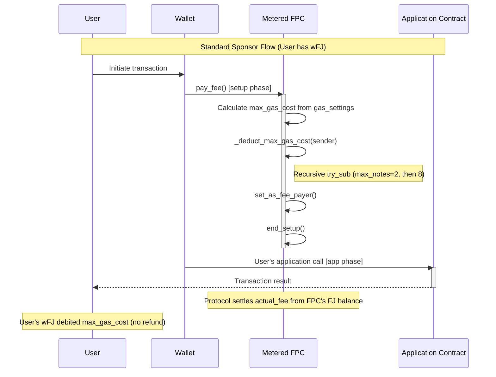
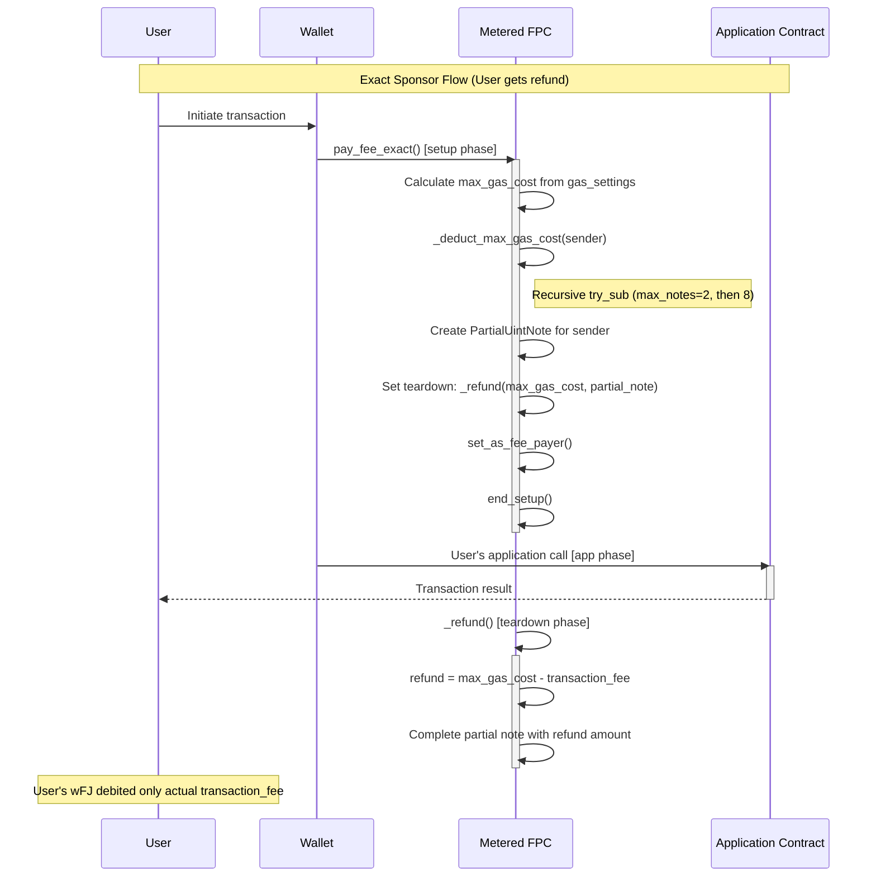
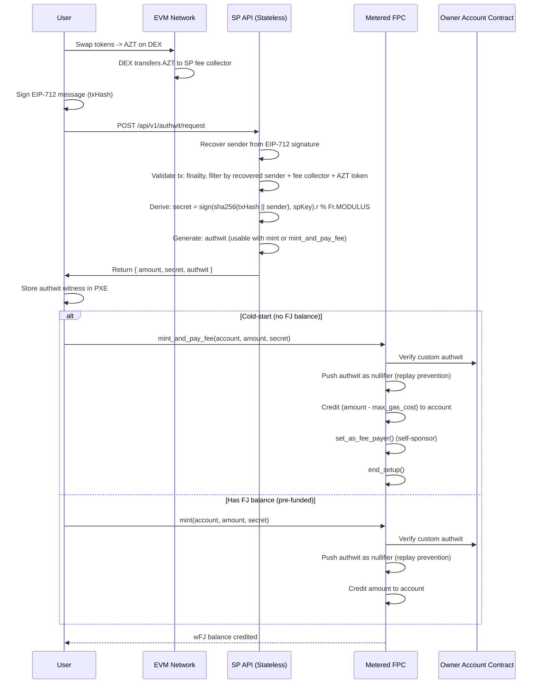

# Fee Payment Contract (FPC) — Product Requirements Document

**Version**: 4.1
**Status**: Active
**Current Phase**: Phase 2 (Authorized Mint with Authwit)
**Target Aztec Version**: 4.1.0-rc.4
**Audience**: Implementation Engineers
**Date**: February 2026

---

## Problem Statement

Users interacting with Aztec need Fee Juice (FJ) to pay for transaction costs, but acquiring and managing FJ directly creates significant UX friction, especially for non-sophisticated EVM users bridging from L1/L2 chains. Users must understand gas mechanics, bridge AZT tokens, and maintain FJ balances—all of which leak privacy and create cold-start problems (users cannot transact without FJ, but cannot get FJ without transacting).

**Who is affected**: All Aztec users, particularly those onboarding from Ethereum mainnet or L2 chains (Base, Arbitrum, etc.).

**Impact of not solving**: Poor onboarding experience, privacy leakage through direct FJ management, high barrier to entry for non-crypto-native users.

---

## Goals

1. **Enable gasless UX**: Users interact with Aztec without directly managing Fee Juice—they use internal balance (wFJ) that abstracts gas mechanics
2. **Preserve privacy**: Shared FPC increases anonymity set; users don't expose their Aztec address when topping up
3. **Minimize proving time**: Minimal gates overhead (sponsor with BalanceNote), prioritize lean transaction flows
4. **Support cold-start**: Users with zero FJ can claim and sponsor transactions atomically

---

## Non-Goals

1. **Zero-trust for L2->Aztec flow**: The trusted path accepts SP (Service Provider) trust for balance distribution.
2. **Zero-sum FJ accounting**: Dust accumulation in FPC is acceptable. We will NOT track perfect invariant `FPC.FJ_balance == FPC.wFJ_total_supply` for non-exact flows.
3. **Pay-per-use model**: Top-up is preferred over per-transaction payments due to privacy implications and SP online requirements.
4. **USD payments within Aztec**: Quote oracles on Aztec add significant gate overhead. Token->AZT conversion happens on EVM.

---

## User Stories

### Service Provider (SP) / FPC Deployer

**As an SP, I want to fund the FPC with Fee Juice so that users can sponsor their transactions.**

- Deploy FPC contract with `owner` address (the account contract that authorizes mints)
- Bridge AZT from L1 to Aztec
- Claim FJ from Fee Juice Portal into FPC
- Use own AccountContract to pay for claim transaction

**As an SP, I want to provide balance to users so they can sponsor transactions.**

- Run a stateless off-chain agent that verifies EVM payments and returns `{ amount, secret, authwit }` to users
- Users call `mint(account, amount, secret)` on Aztec themselves — SP never learns their Aztec address
- Agent is deterministic and horizontally scalable (no database required)

### End User

**As a user with wFJ balance, I want to sponsor my transactions without managing Fee Juice directly.**

- Use `FPCFeePaymentMethod` for simple fee payment (max gas cost deducted, no refund)
- Use `FPCExactFeePaymentMethod` for exact fee payment (refund of unused gas in teardown)
- FPC pays the actual transaction fee from its FJ balance

**As a user, I want to check my remaining fee balance before transacting.**

- Call `balance_of(account)` unconstrained view to query wFJ balance
- Balance is denominated in FJ units

---

## Requirements

### P0 — Must Have

### Noir Contract: Metered FPC

| Requirement | Acceptance Criteria | Status |
| --- | --- | --- |
| **Storage** | `owner: DelayedPublicMutable<AztecAddress, CONFIG_DELAY>` stores the authorized mint signer. `balances: Owned<BalanceSet<Context>>` maps `AztecAddress -> wFJ balance` via `UintNote` private notes. `CONFIG_DELAY = 600` (~half an L2 epoch). | Implemented |
| **Method: `constructor(owner)`** | Public initializer. Schedules the owner via `DelayedPublicMutable`; the value becomes effective after `CONFIG_DELAY` elapses. | Implemented |
| **Method: `update_owner(owner)`** | Public. Only callable by the current owner (`get_current_value()`). Schedules a new owner via `DelayedPublicMutable`. | Implemented |
| **Method: `mint(account, amount, secret)`** | Private. Validates custom authwit (inner hash `H(amount, secret)`) signed by the owner's account contract via `_verify_authwit()`. The authwit is pushed as a nullifier for replay prevention. Credits `amount` to `account`'s balance. Does NOT self-sponsor — use `mint_and_pay_fee()` for cold-start. | Implemented |
| **Method: `mint_and_pay_fee(account, amount, secret)`** | Private, `#[allow_phase_change]`. Same authwit verification as `mint()`, but also deducts `max_gas_cost` from the minted amount and self-sponsors the transaction. Credits `(amount - max_gas_cost)` to `account`. Calls `set_as_fee_payer()` then `end_setup()`. Solves the cold-start problem. | Implemented |
| **Method: `pay_fee()`** | Private, `#[allow_phase_change]`. Deducts max gas cost from `msg_sender`'s wFJ balance using recursive `try_sub` with `INITIAL_TRANSFER_CALL_MAX_NOTES = 2` (falls back to `RECURSIVE_TRANSFER_CALL_MAX_NOTES = 8`); handles change notes with `ONCHAIN_UNCONSTRAINED` delivery; calls `set_as_fee_payer()` then `end_setup()`. No refund of unused gas. | Implemented |
| **Method: `pay_fee_exact()`** | Private, `#[allow_phase_change]`. Same balance deduction as `pay_fee()`, plus creates `PartialUintNote` for refund; sets teardown to call `_refund()`; calls `set_as_fee_payer()` then `end_setup()`. Refunds `max_gas_cost - transaction_fee` in teardown. | Implemented |
| **Method: `_verify_authwit(amount, secret)`** | Internal private. Computes `inner_hash = H(amount, secret)`, reads `owner` from `DelayedPublicMutable`, delegates signature verification to the owner's account contract via `assert_inner_hash_valid_authwit()`. | Implemented |
| **Method: `_refund(max_gas_cost, partial_note)`** | Public, `#[only_self]`. Teardown function called by `pay_fee_exact()`. Calculates `refund_amount = max_gas_cost - transaction_fee` and completes the partial note if refund > 0. | Implemented |
| **Method: `balance_of(account)`** | Unconstrained utility view. Returns the wFJ balance of an account. | Implemented |
| **Library: `get_max_gas_cost(context)`** | `#[contract_library_method]` defined in shared `fpc_lib` package, imported by both MeteredFPC and BridgedFPC. Calculates max gas cost from transaction gas settings: `da_gas_limit * max_fee_per_da_gas + l2_gas_limit * max_fee_per_l2_gas`. Note: teardown gas limits are NOT added separately — the kernel's gas_meter already includes teardown within the gas_limits. | Implemented |

### TypeScript SDK

| Requirement | Acceptance Criteria | Status |
| --- | --- | --- |
| **`FPCFeePaymentMethod`** | Implements `FeePaymentMethod` interface. Works with ANY FPC contract implementing `pay_fee()` — both MeteredFPC and BridgedFPC. Calls `pay_fee()` on the FPC in setup phase. No refund of unused gas. | Implemented |
| **`FPCExactFeePaymentMethod`** | Implements `FeePaymentMethod` interface. Works with any FPC implementing `pay_fee_exact()`. Calls `pay_fee_exact()` on the FPC in setup phase. Refunds unused gas via teardown. | Implemented |
| **`MeteredMintAndPayFeePaymentMethod`** | Implements `FeePaymentMethod`. Calls `mint_and_pay_fee(account, amount, secret)` with authwit witness. Self-sponsors the transaction. Solves cold-start. | Implemented |
| **`MeteredMintThenPayFeePaymentMethod`** | Implements `FeePaymentMethod`. Two-step flow: calls `mint(account, amount, secret)` then `pay_fee()` in the same transaction. Requires existing FJ to pay for the tx. | Implemented |
| **`deployMeteredFPCContract(wallet, owner)`** | Utility to deploy a Metered FPC contract with the given owner. Returns `MeteredFPCContract` instance. | Implemented |
| **`maxFeesPerGasFromBaseFees(baseFees, multiplier)`** | Calculates max fees per gas from current base fees with a safety multiplier (default 3x). Returns `GasFees`. | Implemented |
| **`maxGasCostFor(maxFeesPerGas, gasLimits)`** | Calculates maximum possible gas cost in wei. Formula: `da_gas_limit * max_fee_per_da_gas + l2_gas_limit * max_fee_per_l2_gas`. The `teardownGasLimits` parameter was removed — teardown is already included in the kernel's gas_limits, adding it again was double-counting. Matches the Noir `get_max_gas_cost()` implementation. | Implemented |
| **`DEFAULT_FEE_MULTIPLIER`** | Exported constant `3n`. Default safety multiplier for `maxFeesPerGasFromBaseFees`. | Implemented |
| **`REASONABLE_GAS_LIMITS` / `REASONABLE_TEARDOWN_GAS_LIMITS`** | Default gas limit constants sourced from `@aztec/constants`. `REASONABLE_TEARDOWN_GAS_LIMITS` is used only to configure teardown gas allocation in transactions, NOT for fee calculation. | Implemented |
| **Contract artifacts** | Generated `MeteredFPCContract`, `MeteredFPCContractArtifact`, and `CounterContract` TypeScript bindings from compiled Noir. Public API exports: `MeteredFPCContract` and `MeteredFPCContractArtifact`. `CounterContract`/`CounterContractArtifact` are test-only (not re-exported from main index). | Implemented |

### Off-chain Service (Trusted Flow)

| Requirement | Acceptance Criteria | Status |
| --- | --- | --- |
| **Payment verification** | Off-chain agent verifies EVM transactions on-demand (stateless); validates AZT transfer to fee collector, checks finality, filters by recipient address AND AZT token address, filters by sender (recovered from EIP-712 signature) | Implemented (Agent) |
| **Authwit generation** | On verified AZT payment, agent generates deterministic `{ amount, secret, authwit }` and returns to user; user calls any minting function (`mint` or `mint_and_pay_fee`) on Aztec themselves | Implemented (Agent) |
| **AZT-only acceptance** | Agent only processes AZT token transfers (not arbitrary ERC20s) to the designated fee collector address | Implemented (Agent) |
| **Stateless API** | `POST /api/v1/authwit/request` endpoint; same request always returns same response; no database required | Implemented (Agent) |
| **Agent configuration** | `FPC_ADDRESS` (deployed FPC contract address) and `OWNER_ADDRESS` (authwit signer) configured via environment variables; FPC deployed separately | Implemented (Agent) |

### P1 — Nice to Have

- Script for FPC fill-up of fee juice that automatically refills the FPC when close to being depleted.
- TypeScript `getBalance()` convenience wrapper that calls `balance_of()` and returns the result.

---

## Technical Architecture

### Contract Storage

```noir
#[storage]
struct Storage<Context> {
    owner: DelayedPublicMutable<AztecAddress, CONFIG_DELAY, Context>,
    balances: Owned<BalanceSet<Context>, Context>,
}
```

- **`owner`**: The account contract address that authorizes mints via authwit. Stored as `DelayedPublicMutable` with `CONFIG_DELAY = 600` (~half an L2 epoch); scheduled changes take effect only after the delay elapses. Transferable via `update_owner()`.
- **`balances`**: Maps `AztecAddress` to private wFJ balance using `UintNote` notes

### Deployment Flow

1. SP deploys FPC contract via `deployMeteredFPCContract(wallet, owner)` — the `owner` is the account contract that will authorize mints
2. After `CONFIG_DELAY` (600s) elapses, the owner becomes effective and `mint()` / `mint_and_pay_fee()` can be called
3. SP funds FPC with Fee Juice by bridging from L1 via `fundL2AddressWithFeeJuiceFromL1()`
4. Users obtain authwits from SP's off-chain agent and call a minting function (`mint` or `mint_and_pay_fee`) to credit their balance

### Fee Payment Flow: `pay_fee()` (No Refund)



### Fee Payment Flow: `pay_fee_exact()` (With Refund)



### Gas Cost Calculation

Max gas cost = `da_gas_limit * max_fee_per_da_gas + l2_gas_limit * max_fee_per_l2_gas`

Teardown gas limits are **not** added separately — the kernel's gas_meter already includes teardown within the gas_limits. Adding teardown_gas_limits again was previously causing double-counting (fixed in v4.1).

This formula is implemented identically in both:
- **Noir**: `get_max_gas_cost()` — defined in shared `fpc_lib` library, imported by both MeteredFPC and BridgedFPC
- **TypeScript**: `maxGasCostFor(maxFeesPerGas, gasLimits)` — the `teardownGasLimits` parameter has been removed

Use `maxFeesPerGasFromBaseFees(baseFees, DEFAULT_FEE_MULTIPLIER)` (or `maxFeesPerGasFromBaseFees(baseFees, 3n)`) to calculate fees with a 3x safety multiplier over current base fees.

### SDK Usage

```typescript
import {
  FPCFeePaymentMethod,
  FPCExactFeePaymentMethod,
  MeteredMintAndPayFeePaymentMethod,
  MeteredMintThenPayFeePaymentMethod,
  deployMeteredFPCContract,
  maxFeesPerGasFromBaseFees,
  DEFAULT_FEE_MULTIPLIER,
  REASONABLE_GAS_LIMITS,
  REASONABLE_TEARDOWN_GAS_LIMITS,
} from '@defi-wonderland/aztec-fee-payment';

// Deploy FPC with owner address
const fpc = await deployMeteredFPCContract(wallet, ownerAddress);

// Mint balance for user (requires authwit from the owner's account contract)
await fpc.methods.mint(userAddress, amount, secret)
  .with({ authWitnesses: [authWitness] })
  .send();

const maxFeesPerGas = maxFeesPerGasFromBaseFees(baseFees, DEFAULT_FEE_MULTIPLIER);

// Option 1: pay_fee (no refund) - simpler, cheaper
// Use FPCFeePaymentMethod (works with MeteredFPC and BridgedFPC)
await someContract.methods.doSomething()
  .send({
    fee: {
      paymentMethod: new FPCFeePaymentMethod(fpc.address),
      gasSettings: { gasLimits: REASONABLE_GAS_LIMITS, teardownGasLimits: Gas.empty(), maxFeesPerGas },
    },
  });

// Option 2: pay_fee_exact (with refund) - user pays only actual fee (Metered FPC only)
await someContract.methods.doSomething()
  .send({
    fee: {
      paymentMethod: new FPCExactFeePaymentMethod(fpc.address),
      gasSettings: { gasLimits: REASONABLE_GAS_LIMITS, teardownGasLimits: REASONABLE_TEARDOWN_GAS_LIMITS, maxFeesPerGas },
    },
  });

// Option 3: mint_and_pay_fee (cold-start) - mint and sponsor in one tx
const paymentMethod = new MeteredMintAndPayFeePaymentMethod(
  fpc.address, userAddress, amount, secret, authWitness
);
await someContract.methods.doSomething()
  .send({ fee: { paymentMethod } });

// Query balance
const balance = await fpc.methods.balance_of(userAddress).simulate({ from: userAddress });
```

---

## Test Coverage Matrix

### Integration Tests (TypeScript/vitest)

| Test Case | Method | Expected Result | Status |
| --- | --- | --- | --- |
| `pay_fee SUCCESS: sponsors transaction when user has balance` | `pay_fee()` | Transaction succeeds; FPC FJ balance decreases by actual fee; user wFJ balance decreases by max gas cost | Implemented |
| `pay_fee_exact SUCCESS: sponsors transaction and refunds unused gas` | `pay_fee_exact()` | Transaction succeeds; FPC FJ balance decreases by exact transaction fee; user wFJ balance decreases by exact transaction fee (refund works) | Implemented |
| `pay_fee INVALID: fails when user has insufficient balance` | `pay_fee()` | Transaction rejected (not included in block) when user has no internal balance | Implemented |

### Balance Invariant Tests

| Invariant | Assertion |
| --- | --- |
| Post-mint balance | `user.wFJ_balance == old_balance + minted_amount` |
| Post-`pay_fee` balance | `user.wFJ_balance == old_balance - max_gas_cost` |
| Post-`pay_fee_exact` balance | `user.wFJ_balance == old_balance - actual_transaction_fee` |
| FPC FJ after `pay_fee` | `fpc.fj_balance < fpc.fj_balance_before` (decreased by actual fee) |
| FPC FJ after `pay_fee_exact` | `fpc.fj_balance == fpc.fj_balance_before - transaction_fee` (exact) |

### Test Infrastructure

- Tests require Aztec sandbox running locally (`aztec start --sandbox`)
- Test timeout: 300 seconds (`TEST_TIMEOUT` constant)
- Tests run sequentially (no parallelism) due to shared sandbox state
- `beforeEach` mints fresh balance (100 FJ) for the test account
- `Counter` contract is used as the application contract for testing fee sponsorship
- `fundL2AddressWithFeeJuiceFromL1()` bridges FJ from L1 to fund the FPC

---

## EVM-Side Payment Flow

The off-chain agent serves a stateless API that verifies AZT token transfers on EVM chains and returns authwits for users to mint wFJ on Aztec. Key characteristics:

- **AZT-only**: Only AZT token transfers are accepted (filtered by both recipient AND token address)
- **Stateless & deterministic**: Same `txHash` + same `sender` always returns the same `{ amount, secret, authwit }` — no database required
- **Privacy-preserving**: Agent never learns the user's Aztec address; user calls a minting function (`mint` or `mint_and_pay_fee`) themselves
- **EIP-712 sender recovery**: User signs txHash; agent recovers signer address and uses it to filter Transfer events by `from` field

```
EVM-Side Payment Flow:

1. User swaps tokens -> AZT on DEX (e.g., Uniswap on Base)
2. DEX transfers AZT to SP's fee collector address
3. User signs EIP-712 message (txHash) to prove payment ownership
4. User calls POST /api/v1/authwit/request with { evmTxHash, evmChainId, signature }
5. Agent recovers sender from EIP-712 signature, validates tx finality, filters transfers by recovered sender + fee collector + AZT token
6. Agent derives secret = sign(sha256(txHash || sender), spKey).r % Fr.MODULUS (deterministic ECDSA via RFC 6979)
7. Agent generates authwit and returns { amount, secret, authwit }
8. User stores authwit in PXE and calls a minting function (mint or mint_and_pay_fee) on Aztec
9. User can now sponsor transactions with their wFJ balance
```

> For the detailed off-chain agent specification, see the separate **Off-Chain Agent Specification** document (`docs/Off-Chain Agent — Project Specification.md`).

---

## Phase 2 — Authorized Mint with Custom Authwit

### Overview

Phase 2 replaces the permissionless `mint(account, amount)` with authorized minting via custom authwit. Two mint variants exist: `mint(account, amount, secret)` for pre-funded users, and `mint_and_pay_fee(account, amount, secret)` for cold-start self-sponsoring. The owner is stored as `DelayedPublicMutable` and transferable via `update_owner()`.

### Changes from Phase 1

| Component | Phase 1 (Legacy) | Phase 2 (Current) | Status |
| --- | --- | --- | --- |
| **`mint()` signature** | `mint(account: AztecAddress, amount: u128)` | `mint(account: AztecAddress, amount: u128, secret: Field)` | Implemented |
| **Authorization** | Permissionless | Custom authwit (`H(amount, secret)`) signed by owner's account contract | Implemented |
| **Recipient** | Explicit `account` parameter | Explicit `account` parameter (SP never learns Aztec address since user calls mint themselves) | Implemented |
| **Replay prevention** | None (can mint multiple times) | The authwit itself is pushed as a nullifier | Implemented |
| **Self-sponsoring** | No | Via `mint_and_pay_fee()` — deducts gas from minted amount | Implemented |
| **Storage** | `balances` only | `balances` + `DelayedPublicMutable<AztecAddress, CONFIG_DELAY>` owner | Implemented |
| **Initialization** | None | `constructor(owner: AztecAddress)` — owner effective after `CONFIG_DELAY` | Implemented |
| **Owner transfer** | N/A | `update_owner(owner)` — only callable by current owner | Implemented |
| **EIP-712 verification** | N/A | User signs txHash to prove ownership as token sender (Transfer event `from`) | Implemented |
| **Deterministic secrets** | N/A | `secret = sign(sha256(txHash \|\| sender), spKey).r % Fr.MODULUS` (deterministic ECDSA via RFC 6979) | Implemented |
| **Authwit generation** | N/A | Authwit via Schnorr on Grumpkin (usable with `mint` or `mint_and_pay_fee`) | Implemented |
| **Stateless API** | N/A | `POST /api/v1/authwit/request` | Implemented |

### The Cold-Start Problem

**Problem**: User wants to call `mint()` to get wFJ, but they have no FJ to pay for the `mint()` transaction itself. This is a chicken-and-egg problem.

**Solution**: The FPC **self-sponsors** the mint transaction via `mint_and_pay_fee()`:

1. FPC verifies the authwit and calculates `max_gas_cost`
2. FPC credits `(amount - max_gas_cost)` to the user's balance
3. FPC calls `set_as_fee_payer()` and `end_setup()` to sponsor the transaction

### Preventing Double-Spend

**Authwit as nullifier**: The authwit itself is pushed as a nullifier for replay prevention. If the same authwit is used twice, the nullifier already exists and the transaction fails.

### Griefing Attack Prevention

**The Problem**: If we push the nullifier AFTER calling `set_as_fee_payer()`, an attacker can grief the FPC:

1. Attacker gets valid authwit, submits tx (succeeds, nullifier added)
2. Attacker submits SAME tx again
3. Private execution runs -> FPC commits to pay via `set_as_fee_payer()`
4. Sequencer processes -> nullifier exists -> tx fails
5. **FPC loses gas, attacker pays nothing**

**The Solution**: Push the nullifier BEFORE committing to pay. This will revert in the case that it was already pushed.

```
Secure Execution Order:
1. validate authwit
2. validate amount
3. push_nullifier(authwit) <- FAILS if authwit already used
4. set_as_fee_payer() <- FPC commits ONLY after validation
5. end_setup()
```

### Mint Authorization API (L2->Aztec Trusted Flow)

This specifies how users obtain authwits from the Service Provider (SP) after paying on EVM.

#### EVM-Side Payment Flow

```
1. SWAP: User swaps tokens -> AZT on DEX
2. TRANSFER: DEX sends AZT to SP's fee collector address
3. REQUEST: User signs EIP-712 message (just txHash) to prove payment ownership
4. RESPONSE: SP returns { amount, secret, authwit } deterministically
5. MINT: User calls a minting function (mint or mint_and_pay_fee) on Aztec with stored authwit
```

#### EIP-712 Typed Data Specification

User signs the txHash to prove they control the EVM address that sent the AZT tokens.

```typescript
// EIP-712 Domain
const domain = {
  name: 'Aztec FPC Claim',
  version: '1',
  chainId: 8453,  // EVM chain where payment was made (Base, Ethereum, etc.)
};

// EIP-712 Types - JUST the txHash
const types = {
  ClaimRequest: [
    { name: 'txHash', type: 'bytes32' },  // Payment transaction hash
  ],
};

// User signs ONLY the txHash
const message = {
  txHash: '0xabc123...def',  // The AZT transfer txHash
};
```

#### API Specification

```yaml
POST /api/v1/authwit/request
Content-Type: application/json

Request:
{
  "evmTxHash": "0xabcdef...",   # AZT transfer tx hash (32 bytes hex)
  "evmChainId": 8453,          # Chain where payment was made
  "signature": "0x..."         # EIP-712 signature over txHash (65 bytes)
}

Response (Success - 200):
{
  "amount": "1000000000000000000",    # Total AZT amount (from txHash)
  "secret": "0x789abc...",            # sign(sha256(txHash || sender), spKey).r % Fr.MODULUS (deterministic ECDSA)
  "authwit": {                        # Owner's authwit (usable with mint or mint_and_pay_fee)
    "innerHash": "0x...",             # H(amount, secret)
    "outerHash": "0x...",             # H(consumer, chainId, version, innerHash)
    "witness": ["0x...", "0x...", "0x..."]     # Schnorr signature fields (3 elements)
  }
}

# SP is STATELESS: same txHash + same sender always returns same response!

Response (Error - 400):
{
  "error": "INVALID_SIGNATURE" | "TX_NOT_FOUND" | "TX_REVERTED" | "TX_NOT_FINALIZED" |
           "WRONG_RECIPIENT" | "INVALID_AMOUNT" | "INVALID_CHAIN"
}
```

#### Backend Verification Logic (Stateless)

```
HANDLE_AUTHWIT_REQUEST(evmTxHash, evmChainId, signature):

    1. RECOVER SENDER FROM SIGNATURE
       - Recover EVM address from EIP-712 signature (INVALID_SIGNATURE if malformed)
       - Recovered address is used as `from` filter in subsequent validation

    2. FETCH & VALIDATE TRANSACTION
       - Transaction succeeded
       - Transaction is finalized (enough confirmations)

    3. FILTER & SUM TRANSFERS
       - Parse ERC20 Transfer events from receipt
       - Filter by: `from` (recovered signer), `to` (fee collector), `token` (AZT)
       - Only transfers from the EIP-712 signer are counted
       - If no matching transfers, WRONG_RECIPIENT (signer has no AZT transfers to fee collector)
       - Sum matching transfer amounts, reject if below minimum (INVALID_AMOUNT)

    4. DERIVE SECRET (DETERMINISTIC)
       - secret = sign(sha256(txHash || sender), spKey).r % Fr.MODULUS (deterministic ECDSA via RFC 6979)
       - Input: 32-byte txHash concatenated with 20-byte sender address, SHA-256'd to produce 32-byte ECDSA signing input
       - Same txHash + same sender -> same secret, always

    5. GENERATE AUTHWIT
       - Custom authwit (usable with mint or mint_and_pay_fee)

    6. RETURN
       - { amount, secret, authwit }
       - Stateless: same request = same response
```

### Why Stateless? (Phase 2 Design Properties)

| Property | Explanation |
| --- | --- |
| **No database** | Same txHash + same sender -> same secret -> same authwit, every time |
| **Idempotent** | User can retry request infinitely, always gets same response |
| **Deterministic secret** | `secret = sign(sha256(txHash \|\| sender), spKey).r % Fr.MODULUS` is reproducible (deterministic ECDSA via RFC 6979) |
| **Crash-resilient** | No state to lose, no recovery needed |

### Why This Design? (Phase 2 Benefits)

| Benefit | Explanation |
| --- | --- |
| **Privacy-preserving** | SP never learns user's Aztec address |
| **Stateless SP** | No database, horizontally scalable, crash-resilient |
| **Deterministic** | Same txHash + same sender always produces same response |
| **Custom authwit** | Inner hash uses only `(amount, secret)` — allows any address to claim |
| **Replay prevention** | Authwit is pushed as nullifier after use on Aztec |

### Security Considerations (Phase 2)

1. **SP signing key security**: SP signing key is used for deterministic secret generation (ECDSA) and Schnorr authwit signing. Compromise allows minting of wFJ.
2. **Recipient privacy**: `caller` is NOT in the authwit — the `account` parameter is chosen by the user. SP never learns Aztec address.
3. **Secret determinism**: `secret = sign(sha256(txHash || sender), spKey).r % Fr.MODULUS` (deterministic ECDSA via RFC 6979, `r` component reduced mod BN254 Fr). The signing input is SHA-256 of the 32-byte txHash concatenated with the 20-byte sender address (recovered from EIP-712 signature). Same txHash + same sender = same secret = same authwit.
4. **Replay prevention**: The authwit itself is pushed as a nullifier after use. Same authwit cannot mint twice.
5. **Custom authwit**: Modified authwit inner_hash uses only `(amount, secret)` — no caller, fpcAddress, or selector. Allows any address to claim.
6. **No revocation**: Once authwit is generated, it's valid until secret is used. Stateless means no revocation possible.
7. **EIP-712 verification**: SP recovers the signer address from the EIP-712 signature and uses it as the `from` filter when querying Transfer events. Only transfers sent by the recovered signer are counted, implicitly proving payment ownership.
8. **Stateless availability**: SP has no database. User can retry infinitely—deterministic response.
9. **Cross-chain replay prevention**: Different EVM chains produce different txHashes, so the derived secret is naturally unique per chain. EIP-712 domain also includes EVM `chainId` to bind signatures to a specific chain. Additionally, the sender address is included in the secret derivation input (`sha256(txHash || sender)`), providing per-sender secret isolation.
10. **Cross-sender aggregation prevention**: The sender address is recovered from the EIP-712 signature and used as a filter parameter — only AZT transfers where the `from` field matches the recovered signer are counted. Prevents a multi-sender transaction from crediting all transfer amounts to a single signer.

### Complete End-to-End Flow (Phase 2)



---

## Future: Phase 2+ — Enhanced EVM Privacy

> **Phase 2+** extends the EVM-side payment flow for stronger privacy guarantees.

**Phase 1 (Legacy)**: Naive ERC20 transfers; the off-chain agent can detect nullifiers and know "a user has claimed," though it cannot determine which Aztec address claimed.

**Phase 2+**: A custom EVM contract replaces the naive Transfer flow. Instead of `Transfer(from, to, amount)`, a custom event `AZTReceived(amount, userSecretHash)` is emitted. On the Aztec side, the user provides the `userSecretHash` pre-image that is nullified, making it impossible for the SP to correlate which nullifier corresponds to which payment request.

This flow requires the user to remember the secret pre-image (not "throw your computer in the water" compatible).

To avoid changing the FPC contract, Phase 1 can assume all ERC20 transfers come with a `zero` pre-image for `userSecretHash`, ensuring that Phase 2+ EVM contracts are fully backwards-compatible with the existing Aztec-side FPC (avoiding migration or fragmentation).

---

## Version History

| Version | Date | Changes |
| --- | --- | --- |
| 1.0 | February 2026 | Initial draft with Phase 2 authwit design |
| 2.0 | February 2026 | Updated to reflect Phase 1 implementation: permissionless `mint(account, amount)`, removed owner/initialization, documented `pay_fee_exact()` and `_refund()`, added SDK requirements, moved authwit system to Future Phase 2 section, updated test matrix to match actual tests, added AZT-only token acceptance |
| 3.0 | February 2026 | Updated to Phase 2 as current target: `mint(amount, secret)` with authwit, aligned PRD with Agent Spec implementation, updated EVM payment flow to stateless authwit API, added agent configuration requirements (`FPC_ADDRESS`, `OWNER_ADDRESS`), marked agent-side items as Implemented and contract-side items as Planned |
| 3.1 | February 2026 | Simplified secret generation: replaced `txHash % Fr.MODULUS` with deterministic ECDSA (RFC 6979) signing of txHash, extracting `r` component mod BN254 Fr. Removed domain separator and chainId from secret derivation. Updated API response shape to match implementation (`secret` field, structured `authwit` object with `innerHash`/`outerHash`/`witness`). Added `INVALID_AMOUNT` and `INVALID_CHAIN` error codes. |
| 3.2 | February 2026 | Simplified inner_hash: removed `fpcAddress` and `selector` from inner_hash computation. Inner hash is now `H(amount, secret)` instead of `H(fpcAddress, selector, amount, secret)`. Custom authwit no longer binds to a specific FPC address or function selector. |
| 3.3 | 2026-02-11 | EIP-712 sender verification now checks against the token sender (Transfer event `from` field) instead of the transaction origin (`receipt.from` / `tx.origin`). Updated Backend Verification Logic, security considerations, EVM payment flow, and Phase 2 table to reflect this change. |
| 3.4 | 2026-02-11 | Security hardening: validator now pins sender to first matching AZT transfer and sums only same-sender transfers, preventing cross-sender amount aggregation in multi-sender transactions. Updated payment verification acceptance criteria, Backend Verification Logic, EVM payment flow, sequence diagram, and security considerations. |
| 3.5 | 2026-02-11 | Corrected sender filtering description: sender is recovered from EIP-712 signature (via `recoverClaimRequestSigner`) and passed as `from` filter to the validator — not "pinned to first matching transfer". Removed references to `verifyClaimRequestSignature` (only `recoverClaimRequestSigner` exists). Updated Backend Verification Logic, EVM payment flow, sequence diagram, security considerations #7 and #10, and payment verification acceptance criteria. |
| 3.6 | 2026-02-12 | Secret derivation now includes sender address: `secret = sign(sha256(txHash \|\| sender), spKey).r % Fr.MODULUS`. The 32-byte txHash is concatenated with the 20-byte sender address (recovered from EIP-712 signature) and SHA-256'd to produce the ECDSA signing input. Provides per-sender secret isolation. Updated EVM payment flow, Backend Verification Logic, Phase 2 table, stateless design properties, security considerations #3 and #9, sequence diagram, API response comments, mint() requirement and transition note. |
| 4.0 | 2026-02-25 | Key changes: (1) `owner` is now `DelayedPublicMutable<AztecAddress, CONFIG_DELAY>` with `CONFIG_DELAY = 600`; constructor schedules owner, effective after delay. (2) Added `update_owner(owner)` for transferable ownership. (3) `mint(account, amount, secret)` takes explicit `account` parameter (not `msg_sender`); authwit verified via owner's account contract; nullifier pushed for replay prevention. (4) Added `mint_and_pay_fee(account, amount, secret)` for cold-start self-sponsoring (credits `amount - max_gas_cost`). (5) Removed legacy permissionless `mint(account, amount)`. (6) `pay_fee`/`pay_fee_exact` use `#[allow_phase_change]` (replaces `#[nophasecheck]`) and recursive `try_sub` with `INITIAL_TRANSFER_CALL_MAX_NOTES = 2`. (7) SDK adds `MeteredMintAndPayFeePaymentMethod` and `MeteredMintThenPayFeePaymentMethod`; `deployMeteredFPCContract` now takes `owner` parameter. (8) Target Aztec version bumped to `4.0.0-devnet.1-patch.0`. |
| 4.1 | 2026-03-04 | (1) **Teardown double-counting fix**: `get_max_gas_cost` formula corrected — teardown gas limits removed from calculation (kernel's gas_meter already includes teardown in gas_limits). New formula: `da_gas_limit * max_fee_per_da_gas + l2_gas_limit * max_fee_per_l2_gas`. Fix applies to both Noir and TypeScript. (2) **Shared `fpc_lib`**: `get_max_gas_cost` moved to a shared `fpc_lib` Nargo library package; both MeteredFPC and BridgedFPC now import from it. (3) **SDK**: `maxGasCostFor` drops `teardownGasLimits` parameter; `DEFAULT_FEE_MULTIPLIER = 3n` constant exported; `FPCFeePaymentMethod` replaces `MeteredFeePaymentMethod` as the FPC-agnostic payment class (works with any FPC implementing `pay_fee()`); `FPCExactFeePaymentMethod` replaces `MeteredExactFeePaymentMethod`. `REASONABLE_TEARDOWN_GAS_LIMITS` retained for transaction configuration only, not fee calculation. |
