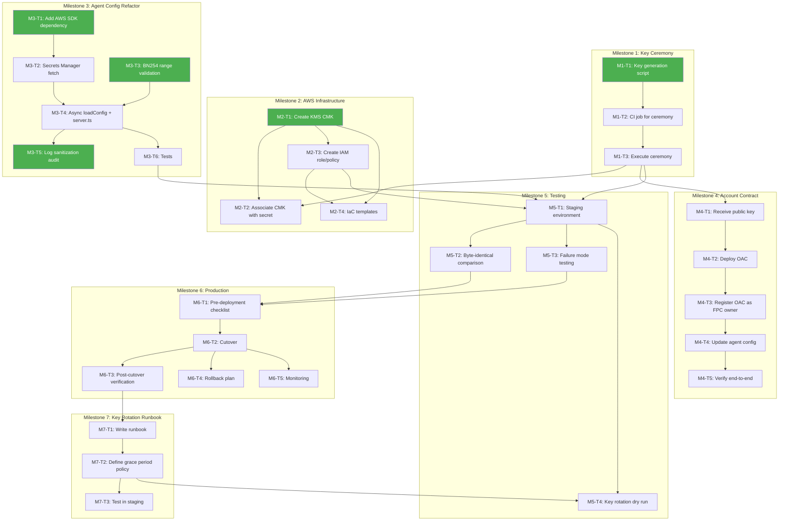

# Signing Key Migration -- Task Breakdown

**Date:** 2026-02-23
**Source:** `docs/signing-key-migration-plan.md`
**Scope:** Migrate `SP_SIGNING_KEY` from plaintext env var to AWS Secrets Manager

---

## Current State

### What exists today

| Component | Location | State |
|-----------|----------|-------|
| Config loader | `src/ts/agent/config/index.ts` | Synchronous `loadConfig()`, reads `SP_SIGNING_KEY` from env at line 29 |
| Zod schema | `src/ts/agent/types/index.ts:94` | `spSigningKey: hexKey` -- **required**, no optional/nullable variant |
| Server factory | `src/ts/agent/server.ts:68-82` | Branches on `signerMode`; `"local"` passes key to `SecretGenerator` + `AuthwitGenerator`; `"lambda"` throws `"not yet implemented"` |
| Entry point | `src/ts/agent/index.ts:46-47` | Both `loadConfig()` and `createServer()` are called synchronously |
| SecretGenerator | `src/ts/agent/services/crypto/secret.ts` | Constructor takes `Hex`, converts to `Uint8Array` (line 28-29); `generateSecret` is sync |
| AuthwitGenerator | `src/ts/agent/services/crypto/authwit.ts` | Constructor takes `ownerSigningKey: Hex` (line 32); converts to `GrumpkinScalar` at line 38; `generateMintAuthwit` is async |
| Crypto interfaces | `src/ts/agent/services/crypto/types.ts` | `ISecretGenerator.generateSecret` returns `Hex \| Promise<Hex>` -- already async-compatible |
| Lambda scaffolding | `src/ts/agent/types/index.ts:110-131` | `signerMode`, `signerLambdaArn`, `signerLambdaRegion` already in Zod schema with `superRefine` validation |
| BN254 modulus | `src/ts/agent/services/crypto/secret.ts:8` and `src/ts/agent/test/helpers.ts:27` | Constant exists in two places but NOT used for startup key validation |
| Agent .env.example | `src/ts/agent/.env.example` | Documents `SP_SIGNING_KEY` as required; no Secrets Manager vars |
| AWS SDK | not present | No `@aws-sdk/*` packages in `package.json` |
| IaC | not present | No Terraform, CDK, CloudFormation, or Dockerfiles anywhere in the repo |
| CI/CD | `.github/workflows/` | 4 workflows (pr-checks, main-tests, update-baseline, pre-release) -- no deployment pipeline |
| Contract | `src/nr/metered_contract/src/main.nr` | No owner field; `mint()` is permissionless (Phase 1); single `balances: Owned<BalanceSet>` storage |
| Test helpers | `src/ts/agent/test/helpers.ts` | `TEST_KEY`, `createTestConfig()`, `createTestEnv()` -- all hardcode `SP_SIGNING_KEY` as required |
| Test files | `src/ts/agent/test/` | 7 test files: config, secret, authwit, eip712, evm-parser, validator, integration |

### What does NOT exist

- No AWS SDK dependency
- No Secrets Manager fetch logic
- No BN254 range validation at startup (only used post-hoc in `generateSecret` via modular reduction)
- No key generation script
- No IaC templates
- No deployment pipeline for the agent itself
- No account contract deployment script (only FPC deployment in `scripts/deploy.ts`)

---

## Key Technical Decisions

These decisions must be resolved before or during implementation. Each is tagged with the task(s) it blocks.

| # | Decision | Options | Blocks |
|---|----------|---------|--------|
| D1 | **Secrets Manager secret format** -- Should the secret be stored as a plain hex string or as a JSON object (e.g., `{"SP_SIGNING_KEY": "0x..."}`)? | Plain hex is simpler; JSON allows storing metadata (version, created_at) alongside the key. The migration plan says "extract `SP_SIGNING_KEY` from the JSON value," implying JSON. | M3-T2 |
| D2 | **IaC tool choice** -- Terraform, CDK, or CloudFormation? | No existing IaC in the repo; CDK uses TypeScript (team already uses TS); Terraform is more portable. | M2-T4 |
| D3 | **Retry behavior on Secrets Manager failure** -- Exponential backoff with how many retries? What is the maximum startup delay? | Affects M3-T2. Suggestion: 3 retries, 1s/2s/4s backoff, then fatal error. | M3-T2, M5-T3 |
| D4 | **Signer mode consolidation** -- The existing schema has `signerMode: "local" \| "lambda"`. Should we add `"secrets-manager"` as a third mode, or follow the migration plan's simpler approach (presence of `SP_KEY_SECRET_ID` triggers SM fetch, no new signer mode)?  | The migration plan recommends the simpler approach. The existing `signerMode`/lambda scaffolding becomes orthogonal (lambda = where signing happens; SM = where the key is stored). | M3-T2 |
| D5 | **AWS region source** -- Should `AWS_REGION` be an explicit env var or inferred from the SDK's default chain (instance metadata, `~/.aws/config`, `AWS_REGION` env)?  | The SDK default chain is standard practice. Explicit env var is more debuggable. Suggestion: use SDK default chain; document `AWS_REGION` as required in ECS task definition. | M3-T2 |
| D6 | **Key rotation: drain-and-cutover vs. overlapping keys** -- The migration plan offers both. Which is the target for Phase 1? | Drain-and-cutover is simpler and sufficient for Phase 1 since `mint()` is permissionless (no on-chain key verification yet). | M7-T2 |

---

## Dependency Graph



**Parallel entry points (green nodes):** M1-T1, M2-T1, M3-T1, M3-T3, and M3-T5 can all start immediately with no dependencies.

---

## Milestone 1: Key Generation Ceremony

**Goal:** Generate `SP_SIGNING_KEY` in an isolated environment and store it directly in Secrets Manager. No human sees the private key.

---

### M1-T1: Write the key generation script

**Description:**
Create a standalone Node.js script that generates a cryptographically random 32-byte private key, validates it falls within the BN254 scalar field, stores it in AWS Secrets Manager, and prints only the derived public keys (Grumpkin and secp256k1). The script must never print or log the private key.

The BN254 Fr modulus is `0x30644e72e131a029b85045b68181585d2833e84879b9709143e1f593f0000001` (already defined at `src/ts/agent/services/crypto/secret.ts:8` and `src/ts/agent/test/helpers.ts:27`). Approximately 25% of random 32-byte values exceed this modulus, so the script must use reject-and-retry (NOT modular reduction, which introduces bias).

**Files to create:**
- `scripts/generate-key.ts` -- The key generation script

**Files to reference (read-only):**
- `src/ts/agent/services/crypto/secret.ts:7-8` -- BN254_FR_MODULUS constant
- `src/ts/agent/services/crypto/authwit.ts:38` -- How `GrumpkinScalar.fromString()` is used

**Implementation details:**
1. Use `crypto.getRandomValues(new Uint8Array(32))` for key generation
2. Interpret bytes as big-endian unsigned integer
3. Check `1 <= value <= BN254_FR_MODULUS - 1`; if out of range, discard and retry
4. Store as JSON in Secrets Manager: `{ "SP_SIGNING_KEY": "0x..." }` (see Decision D1)
5. Derive Grumpkin public key: `GrumpkinScalar.fromString(key)` then multiply by Grumpkin generator (from `@aztec/foundation/curves/grumpkin`)
6. Derive secp256k1 public key: `secp256k1.getPublicKey(keyBytes)` (from `@noble/curves/secp256k1`)
7. Print ONLY the two public keys to stdout
8. Accept CLI args: `--secret-id` (Secrets Manager secret name, default `aztec-fpc/sp-signing-key`), `--region` (AWS region)

**Acceptance criteria:**
- [ ] Script generates a valid BN254 Fr scalar on every run
- [ ] Script rejects and retries values outside `[1, BN254_FR_MODULUS - 1]`
- [ ] Script stores the key in Secrets Manager via `@aws-sdk/client-secrets-manager`
- [ ] Script prints Grumpkin public key and secp256k1 public key to stdout
- [ ] Script prints NO private key material to stdout, stderr, or any log
- [ ] Script exits with code 0 on success, non-zero on failure
- [ ] Script has a `--dry-run` flag that generates and validates the key, prints public keys, but does NOT call Secrets Manager (for testing)

**Dependencies:** None

**Estimated complexity:** M

**Agent type:** General-purpose with bash access (needs `@aztec/foundation` and `@noble/curves` for key derivation)

---

### M1-T2: Create CI job for ceremony execution

**Description:**
Create a manually-triggered GitHub Actions workflow that runs the key generation script from M1-T1 on an ephemeral runner. The workflow must use OIDC federation (or short-lived credentials) to authenticate with AWS, scoped to only `secretsmanager:PutSecretValue` and `kms:Encrypt` permissions. The runner is destroyed after the job completes.

**Files to create:**
- `.github/workflows/key-ceremony.yml`

**Files to reference (read-only):**
- `.github/workflows/pr-checks.yml` -- Existing workflow for runner configuration patterns
- `scripts/generate-key.ts` -- The script this workflow executes (from M1-T1)

**Implementation details:**
1. Trigger: `workflow_dispatch` with inputs for `secret-id` (string, default `aztec-fpc/sp-signing-key`) and `region` (string, default `us-east-1`)
2. Runner: `ubuntu-latest` (ephemeral by default on GitHub-hosted runners)
3. AWS auth: `aws-actions/configure-aws-credentials` with OIDC (`role-to-assume`)
4. IAM permissions for the OIDC role: `secretsmanager:PutSecretValue`, `kms:Encrypt` only
5. Steps: checkout, setup Node.js 22, `yarn install`, run `tsx scripts/generate-key.ts --secret-id ${{ inputs.secret-id }} --region ${{ inputs.region }}`
6. Capture Grumpkin public key as a job output using `$GITHUB_OUTPUT`
7. Do NOT store or echo any private key material

**Acceptance criteria:**
- [ ] Workflow is manual-only (`workflow_dispatch`)
- [ ] OIDC role has ONLY `secretsmanager:PutSecretValue` and `kms:Encrypt` -- no read permissions
- [ ] Grumpkin public key is available as a job output
- [ ] No private key material appears in workflow logs
- [ ] Workflow completes and runner is destroyed (standard GitHub-hosted behavior)

**Dependencies:** M1-T1

**Estimated complexity:** S

**Agent type:** General-purpose (GitHub Actions YAML authoring)

---

### M1-T3: Execute the ceremony

**Description:**
Run the CI job from M1-T2 (or the script from M1-T1 in AWS CloudShell as a fallback). Record the Grumpkin and secp256k1 public keys. Verify the secret exists in Secrets Manager without reading its value.

This is a manual operations task, not a code task. Documenting it here for completeness and to define exit criteria.

**Steps:**
1. Trigger the `key-ceremony.yml` workflow (or run `tsx scripts/generate-key.ts` in CloudShell)
2. Record the Grumpkin public key from the job output
3. Record the secp256k1 public key from the job output
4. Verify secret existence: `aws secretsmanager describe-secret --secret-id aztec-fpc/sp-signing-key`
5. Do NOT call `aws secretsmanager get-secret-value`

**Acceptance criteria:**
- [ ] Private key stored in Secrets Manager (verified via `describe-secret`)
- [ ] Grumpkin public key documented in a secure location
- [ ] secp256k1 public key documented in a secure location
- [ ] No private key material in CI logs, local filesystems, or chat history

**Dependencies:** M1-T1, M1-T2

**Estimated complexity:** S

**Agent type:** Operations/manual (not automatable by a code agent)

---

## Milestone 2: AWS Infrastructure

**Goal:** Provision KMS CMK, associate it with the secret, and create the agent's IAM role. Can start in parallel with Milestone 1 (except M2-T2 which needs the secret to exist).

---

### M2-T1: Create KMS Customer Managed Key (CMK)

**Description:**
Create a KMS symmetric key (AES-256) for encrypting the Secrets Manager secret. Enable automatic annual rotation. Create an alias `alias/aztec-fpc-agent-secrets`.

This can be done via the AWS Console, CLI, or IaC (if M2-T4 is being done concurrently). If done manually, document the key ARN for use in M2-T2 and M2-T3.

**Details:**
- Service: AWS KMS
- Key spec: `SYMMETRIC_DEFAULT` (AES-256-GCM)
- Alias: `alias/aztec-fpc-agent-secrets`
- Automatic rotation: enabled (365 days)
- Key policy: restrict `kms:Decrypt` to the agent's ECS task execution role (created in M2-T3)

**Acceptance criteria:**
- [ ] CMK created with alias `alias/aztec-fpc-agent-secrets`
- [ ] Automatic rotation enabled
- [ ] Key ARN documented for use in subsequent tasks

**Dependencies:** None

**Estimated complexity:** S

**Agent type:** AWS infrastructure (Console/CLI or IaC)

---

### M2-T2: Associate CMK with the secret

**Description:**
After the ceremony (M1-T3) creates the secret with the default `aws/secretsmanager` key, update it to use the CMK created in M2-T1. Tag the secret with project and environment metadata.

**Command:**
```bash
aws secretsmanager update-secret \
  --secret-id aztec-fpc/sp-signing-key \
  --kms-key-id alias/aztec-fpc-agent-secrets

aws secretsmanager tag-resource \
  --secret-id aztec-fpc/sp-signing-key \
  --tags Key=project,Value=aztec-fpc Key=environment,Value=production
```

**Acceptance criteria:**
- [ ] Secret encrypted with the CMK (verify via `describe-secret` -- `KmsKeyId` field matches the CMK ARN)
- [ ] Secret tagged with `project:aztec-fpc` and `environment:production`

**Dependencies:** M1-T3 (secret must exist), M2-T1 (CMK must exist)

**Estimated complexity:** S

**Agent type:** AWS infrastructure (CLI one-liner)

---

### M2-T3: Create agent IAM role and policy

**Description:**
Create an IAM role for the agent's ECS task (or EC2 instance) with least-privilege access to Secrets Manager and KMS. The role should be able to read the signing key secret and decrypt its envelope -- nothing else.

**Policy document (inline or managed):**

| Permission | Resource | Purpose |
|------------|----------|---------|
| `secretsmanager:GetSecretValue` | `arn:aws:secretsmanager:<region>:<account>:secret:aztec-fpc/sp-signing-key-*` | Fetch the signing key |
| `kms:Decrypt` | `arn:aws:kms:<region>:<account>:key/<cmk-key-id>` | Decrypt the secret's envelope |

**Anti-requirements:**
- No `secretsmanager:PutSecretValue` -- the agent can read but never write
- No wildcard resources -- scoped to the specific secret and key ARNs

**Acceptance criteria:**
- [ ] IAM role created with trust policy for ECS task execution (or EC2 instance profile)
- [ ] Policy grants ONLY `secretsmanager:GetSecretValue` and `kms:Decrypt`
- [ ] Resources scoped to the specific secret ARN and CMK ARN (no wildcards)
- [ ] Agent can successfully call `GetSecretValue` from its execution environment

**Dependencies:** M2-T1 (need CMK ARN for policy resource)

**Estimated complexity:** S

**Agent type:** AWS infrastructure

---

### M2-T4: Write IaC templates

**Description:**
Create reproducible infrastructure-as-code templates for all AWS resources provisioned in M2-T1 through M2-T3. This ensures the infrastructure can be recreated for staging environments and is auditable.

The IaC tool choice is an open decision (see Decision D2). The project has no existing IaC -- this is greenfield.

**Files to create:**
- `infra/` directory with templates for:
  - KMS CMK + alias
  - Secrets Manager secret reference (NOT the value -- the value is set by the ceremony)
  - IAM policy and role
  - (Optional) ECS task definition updates if ECS is already IaC-managed

**Acceptance criteria:**
- [ ] Templates are syntactically valid and can be deployed to a fresh AWS account
- [ ] Templates use parameterized region and account ID (not hardcoded)
- [ ] Secret value is NOT included in templates -- only the resource definition
- [ ] Templates include a README explaining how to deploy

**Dependencies:** M2-T1 (know what resources to codify), M2-T3 (know IAM policy)

**Estimated complexity:** M

**Agent type:** AWS infrastructure / IaC specialist

---

## Milestone 3: Agent Config Refactor

**Goal:** Replace the `SP_SIGNING_KEY` env var read with an optional Secrets Manager fetch on startup. This is the core code change. No architectural changes -- the key is fetched once, then used exactly as before.

---

### M3-T1: Add `@aws-sdk/client-secrets-manager` dependency

**Description:**
Add the AWS SDK v3 Secrets Manager client to the project's dependencies. Verify it does not break existing agent tests or significantly increase bundle size. The AWS SDK v3 is modular and tree-shakeable, so only the Secrets Manager client is needed.

**Files to modify:**
- `package.json` -- Add `"@aws-sdk/client-secrets-manager"` to `dependencies` (not devDependencies, since the agent needs it at runtime)

**Files to verify after change:**
- `vitest.agent.config.ts` -- May need to add `/@aws-sdk/` to the `server.deps.inline` array (line 26) if vitest fails to resolve the module
- Run `yarn test:agent` to confirm all 7 existing test files still pass

**Acceptance criteria:**
- [ ] `@aws-sdk/client-secrets-manager` is in `dependencies` in `package.json`
- [ ] `yarn install` completes without errors
- [ ] All existing agent tests pass: `yarn test:agent`
- [ ] No other package versions are affected (check `yarn.lock` diff is scoped to the new package and its transitive deps)

**Dependencies:** None

**Estimated complexity:** S

**Agent type:** General-purpose with bash access

---

### M3-T2: Implement Secrets Manager fetch in config loading

**Description:**
Modify the config loading logic to support two key sources: (1) AWS Secrets Manager when `SP_KEY_SECRET_ID` is set, or (2) the existing `SP_SIGNING_KEY` env var as a fallback. The presence of `SP_KEY_SECRET_ID` is the signal -- no new `SIGNER_MODE` value is needed (see Decision D4).

This requires making `loadConfig()` async and creating a new helper function for the Secrets Manager fetch.

**Files to create:**
- `src/ts/agent/config/secrets.ts` -- New module encapsulating the Secrets Manager fetch logic

**Files to modify:**
- `src/ts/agent/config/index.ts` -- Change `loadConfig()` from sync to async; add `SP_KEY_SECRET_ID` reading; call secrets fetch when present
- `src/ts/agent/types/index.ts` -- Make `spSigningKey` conditionally optional (see details below)

**Implementation details for `src/ts/agent/config/secrets.ts`:**
```typescript
// Encapsulates Secrets Manager interaction
// - Creates SecretsManagerClient with region from SDK default chain or explicit AWS_REGION
// - Calls GetSecretValueCommand with the provided secret ID
// - Parses the JSON response and extracts SP_SIGNING_KEY
// - Implements retry with exponential backoff (see Decision D3)
// - Never logs the secret value
```

**Implementation details for `src/ts/agent/config/index.ts`:**
1. Add `spKeySecretId: env.SP_KEY_SECRET_ID` to the `raw` object (line 24-46)
2. Change function signature: `export async function loadConfig(...)`
3. After Zod parse, if `config.spKeySecretId` is set, call `fetchSigningKey(config.spKeySecretId)` from the new secrets module
4. Assign the fetched key to `config.spSigningKey`
5. Return the config as before

**Implementation details for `src/ts/agent/types/index.ts`:**
- Add `spKeySecretId: z.string().min(1).optional()` to the config schema (after line 94)
- Add a `superRefine` rule: at least one of `spSigningKey` or `spKeySecretId` must be provided. If neither is set, issue a Zod error. This replaces the current unconditional requirement for `spSigningKey`.
- Change `spSigningKey` at line 94 from `hexKey` (required) to `hexKey.optional()` -- it will be populated from Secrets Manager if not provided via env

**Acceptance criteria:**
- [ ] `loadConfig()` is async and returns `Promise<AgentConfig>`
- [ ] When `SP_KEY_SECRET_ID` is set, the signing key is fetched from Secrets Manager
- [ ] When `SP_KEY_SECRET_ID` is NOT set, `SP_SIGNING_KEY` env var is read directly (existing behavior)
- [ ] Zod validation fails if neither `SP_KEY_SECRET_ID` nor `SP_SIGNING_KEY` is provided
- [ ] Secrets Manager errors produce a clear fatal error message WITHOUT logging the key
- [ ] Retry logic: 3 retries with exponential backoff (1s, 2s, 4s), then throw
- [ ] The `AgentConfig` type always has `spSigningKey: Hex` populated after `loadConfig()` resolves (regardless of source)

**Dependencies:** M3-T1

**Estimated complexity:** L

**Agent type:** General-purpose with bash access

---

### M3-T3: Add BN254 range validation on startup

**Description:**
After the signing key is obtained (from either Secrets Manager or env var), validate that it falls within `[1, BN254_FR_MODULUS - 1]`. This catches misconfigured secrets, key generation bugs, and accidental key corruption. The validation must happen before the key is passed to `SecretGenerator` or `AuthwitGenerator`.

The BN254 Fr modulus is already defined at `src/ts/agent/services/crypto/secret.ts:7-8` and `src/ts/agent/test/helpers.ts:27`. Extract it to a shared constant to avoid duplication.

**Files to create:**
- `src/ts/agent/config/validation.ts` -- BN254 range validation function and shared constant

**Files to modify:**
- `src/ts/agent/config/index.ts` -- Call `validateSigningKey(config.spSigningKey)` after the key is set (whether from SM or env)
- `src/ts/agent/services/crypto/secret.ts` -- Import `BN254_FR_MODULUS` from the new shared location instead of defining it locally (line 7-8)
- `src/ts/agent/test/helpers.ts` -- Import `BN254_FR_MODULUS` from the new shared location instead of defining it locally (line 27-28)

**Implementation for `src/ts/agent/config/validation.ts`:**
```typescript
export const BN254_FR_MODULUS = 21888242871839275222246405745257275088548364400416034343698204186575808495617n;

export function validateSigningKey(key: Hex): void {
  const value = BigInt(key);
  if (value < 1n || value >= BN254_FR_MODULUS) {
    throw new Error(
      'SP_SIGNING_KEY is outside the valid BN254 Fr range [1, BN254_FR_MODULUS - 1]. ' +
      'The key may be misconfigured, corrupted, or generated without range validation.'
    );
    // NOTE: Do NOT log the key value in this error message.
  }
}
```

**Acceptance criteria:**
- [ ] `validateSigningKey()` throws for `key = 0`
- [ ] `validateSigningKey()` throws for `key >= BN254_FR_MODULUS`
- [ ] `validateSigningKey()` succeeds for `key = 1`
- [ ] `validateSigningKey()` succeeds for `key = BN254_FR_MODULUS - 1`
- [ ] Error message does NOT contain the key value
- [ ] `BN254_FR_MODULUS` is defined in exactly one place and imported by `secret.ts` and `helpers.ts`
- [ ] Validation is called inside `loadConfig()` before the config is returned

**Dependencies:** None (can start immediately; integrates with M3-T4 when wiring into `loadConfig`)

**Estimated complexity:** S

**Agent type:** General-purpose

---

### M3-T4: Update `server.ts` and `index.ts` for async config loading

**Description:**
Since `loadConfig()` is now async (M3-T2), update all call sites. The server factory (`createServer`) itself remains synchronous -- it receives the already-resolved config. The main entry point in `index.ts` needs an async wrapper.

**Files to modify:**
- `src/ts/agent/index.ts` -- Wrap the startup block (lines 45-67) in an async IIFE; change line 46 from `const config = loadConfig()` to `const config = await loadConfig()`
- `src/ts/agent/server.ts` -- No changes needed (receives resolved `AgentConfig`)

**Current code at `src/ts/agent/index.ts:42-47`:**
```typescript
const isMainModule = process.argv[1] && import.meta.url.endsWith(process.argv[1].replace(/\\/g, "/"));
if (isMainModule) {
  const config = loadConfig();
  const { app, logger } = createServer(config);
```

**New code:**
```typescript
if (isMainModule) {
  (async () => {
    const config = await loadConfig();
    const { app, logger } = createServer(config);
    // ... rest of startup unchanged
  })().catch((err) => {
    console.error("Fatal: failed to start agent", err);
    process.exit(1);
  });
}
```

**Acceptance criteria:**
- [ ] `index.ts` calls `await loadConfig()` inside an async IIFE
- [ ] Fatal startup errors (including Secrets Manager failures and BN254 validation) are caught and logged, then `process.exit(1)`
- [ ] `server.ts` has NO changes (still receives synchronous `AgentConfig`)
- [ ] `yarn agent:dev` still starts correctly with `SP_SIGNING_KEY` env var

**Dependencies:** M3-T2 (loadConfig is async), M3-T3 (validation is wired in)

**Estimated complexity:** S

**Agent type:** General-purpose

---

### M3-T5: Log sanitization audit

**Description:**
Audit every log statement in the agent codebase to ensure no path can leak `SP_SIGNING_KEY` or derived key material. This includes startup logs, request/response logging, error handlers, and stack traces.

**Files to audit:**
- `src/ts/agent/config/index.ts` -- Ensure the fetched secret value is not logged after fetch
- `src/ts/agent/config/secrets.ts` -- Ensure the Secrets Manager response is not logged (created in M3-T2)
- `src/ts/agent/server.ts` -- Ensure `config.spSigningKey` is not in any log statement (lines 16-106)
- `src/ts/agent/middleware/` -- Ensure request/response logging middleware does not serialize the full config or signing outputs
- `src/ts/agent/errors.ts` -- Ensure error serialization does not include key material in stack traces
- `src/ts/agent/routes/authwit.ts` -- Ensure authwit generation errors do not log the signing key
- `src/ts/agent/services/crypto/secret.ts` -- No logger present (good), but verify constructor does not log
- `src/ts/agent/services/crypto/authwit.ts` -- No logger present (good), but verify constructor does not log

**Acceptance criteria:**
- [ ] No log statement anywhere in `src/ts/agent/` can output `spSigningKey`, `signingKey`, or raw key bytes
- [ ] Config object is not logged in full (e.g., `logger.info({ config }, "...")` would be a violation)
- [ ] Error stack traces from signing operations do not include key hex strings
- [ ] Findings documented in a checklist (this task's output is a report + any fixes)

**Dependencies:** None (can start immediately as a read-only audit; apply fixes after M3-T4 is merged)

**Estimated complexity:** S

**Agent type:** Code reviewer / security-focused agent

---

### M3-T6: Write tests for new config behavior

**Description:**
Add tests covering the new Secrets Manager config path, the BN254 validation, and the async `loadConfig()` behavior. All existing tests must continue to pass unchanged.

**Files to modify:**
- `src/ts/agent/test/config.test.ts` -- Add new test cases for SM mode and BN254 validation
- `src/ts/agent/test/helpers.ts` -- Update `createTestConfig()` and `createTestEnv()` if the `AgentConfig` type changed (e.g., `spSigningKey` is now optional pre-resolution)

**Files to create:**
- `src/ts/agent/test/secrets.test.ts` -- Unit tests for the new `src/ts/agent/config/secrets.ts` module (mock `@aws-sdk/client-secrets-manager`)
- `src/ts/agent/test/validation.test.ts` -- Unit tests for `src/ts/agent/config/validation.ts`

**Test cases for `config.test.ts` (add to existing file):**

1. **SM mode -- fetches key from Secrets Manager when `SP_KEY_SECRET_ID` is set:**
   Mock the AWS client to return a known key. Verify `loadConfig()` resolves with that key in `spSigningKey`. `SP_SIGNING_KEY` should NOT be in the env.

2. **SM mode -- falls back to env var when `SP_KEY_SECRET_ID` is NOT set:**
   Verify existing behavior unchanged (this is effectively the existing "loads a valid config from env vars" test, but now calling `await loadConfig()`).

3. **SM mode -- throws when NEITHER `SP_KEY_SECRET_ID` nor `SP_SIGNING_KEY` is provided:**
   Verify Zod validation error.

4. **SM mode -- `SP_SIGNING_KEY` env var takes precedence when BOTH are set:**
   Define expected behavior (prefer env var? prefer SM? error?). Recommendation: prefer SM when `SP_KEY_SECRET_ID` is set, ignore `SP_SIGNING_KEY` env var -- the presence of `SP_KEY_SECRET_ID` is an explicit intent to use SM.

**Test cases for `validation.test.ts`:**

5. **BN254 validation -- accepts key = 1**
6. **BN254 validation -- accepts key = BN254_FR_MODULUS - 1**
7. **BN254 validation -- rejects key = 0**
8. **BN254 validation -- rejects key = BN254_FR_MODULUS**
9. **BN254 validation -- rejects key = BN254_FR_MODULUS + 1**
10. **BN254 validation -- error message does NOT contain the key value**

**Test cases for `secrets.test.ts`:**

11. **Fetches and parses JSON secret correctly**
12. **Retries on transient failure (mock first call to throw, second to succeed)**
13. **Throws after max retries exceeded**
14. **Throws on empty secret value**
15. **Throws on malformed JSON in secret value**

**Test runner verification:**
- `yarn test:agent` must pass all tests (existing + new)
- Vitest agent config at `vitest.agent.config.ts` may need `/@aws-sdk/` added to `server.deps.inline` (line 26)

**Acceptance criteria:**
- [ ] All 15 test cases above are implemented and passing
- [ ] All 7 existing test files still pass with no modifications (except `config.test.ts` and `helpers.ts` which are updated)
- [ ] AWS SDK client is mocked in all tests -- no real AWS calls
- [ ] `yarn test:agent` passes cleanly

**Dependencies:** M3-T2 (SM fetch implementation), M3-T3 (validation implementation), M3-T4 (async loadConfig)

**Estimated complexity:** M

**Agent type:** General-purpose with bash access

---

## Milestone 4: Account Contract Deployment

**Goal:** Deploy an Owner Account Contract (OAC) on Aztec using the Grumpkin public key from the ceremony, then register it as the FPC owner.

**BLOCKING NOTE:** Tasks M4-T3 through M4-T5 require the Phase 2 FPC contract upgrade (adding `initialize(owner)` and on-chain authwit verification). In Phase 1, `mint()` is permissionless and there is no on-chain owner. Milestones 1-3 and 5-7 can proceed without this.

---

### M4-T1: Receive and verify the public key

**Description:**
Receive the Grumpkin public key from the ceremony output (M1-T3). Verify the public key is a valid Grumpkin curve point before using it for deployment.

**Steps:**
1. Obtain the Grumpkin public key hex from the ceremony CI artifact or secure channel
2. Verify it is a valid point on the Grumpkin curve (use `@aztec/foundation/curves/grumpkin` utilities)
3. Store the verified public key for use in M4-T2

**Acceptance criteria:**
- [ ] Grumpkin public key obtained from ceremony output
- [ ] Public key verified as a valid Grumpkin curve point
- [ ] Key stored securely for deployment use

**Dependencies:** M1-T3

**Estimated complexity:** S

**Agent type:** Operations / manual

---

### M4-T2: Deploy the Owner Account Contract (OAC)

**Description:**
Deploy a `SingleKeyAccountContract` on Aztec using the Grumpkin public key from M4-T1. This is Aztec's standard account contract that stores a public key and verifies Schnorr signatures via `is_valid_impl()`.

The deployer only needs the Grumpkin public key -- not the private key.

**Files to create:**
- `scripts/deploy-oac.ts` -- Deployment script for the OAC

**Files to reference:**
- `scripts/deploy.ts` -- Existing FPC deployment script for patterns (commander CLI, network config)
- `config/config.ts` -- Network configuration (node URLs, retry options)

**Implementation details:**
1. Instantiate `SingleKeyAccountContract` with the Grumpkin public key from the ceremony
2. Deploy via `AccountManager.deploy()` (from `@aztec/accounts`)
3. Record the deployed OAC address
4. Save the address to `deployments/<network>/oac-deployment-<timestamp>.json`

**Acceptance criteria:**
- [ ] Script deploys OAC with the provided Grumpkin public key
- [ ] Script supports `--network` flag (devnet/testnet/local-network) matching existing patterns
- [ ] Deployed address is recorded to the `deployments/` directory
- [ ] Script does NOT require the private key as input

**Dependencies:** M4-T1

**Estimated complexity:** M

**Agent type:** General-purpose with bash access (Aztec SDK knowledge)

---

### M4-T3: Register the OAC as the FPC owner

**Description:**
This task requires the **Phase 2 FPC contract upgrade** which is NOT yet implemented. The Phase 2 upgrade must add:
1. `PublicImmutable<AztecAddress>` owner storage to the contract
2. `initialize(owner: AztecAddress)` constructor
3. Authwit verification in `mint()` that calls `OAC.is_valid(outer_hash, witness)`

After the Phase 2 contract is deployed, call `initialize(OWNER_ADDRESS)` where `OWNER_ADDRESS` is the OAC address from M4-T2.

**Current contract state** (`src/nr/metered_contract/src/main.nr`):
- Storage has only `balances: Owned<BalanceSet>` (line 19-21) -- no owner field
- `mint()` at line 91 is completely permissionless -- no authwit check

**Files to modify (Phase 2 -- out of scope for this migration):**
- `src/nr/metered_contract/src/main.nr` -- Add owner storage, initialize, authwit verification

**Acceptance criteria:**
- [ ] Phase 2 FPC contract deployed with owner support
- [ ] `initialize()` called with the OAC address from M4-T2
- [ ] Authwit verification functional in `mint()`

**Dependencies:** M4-T2, Phase 2 FPC contract upgrade (external dependency)

**Estimated complexity:** L (includes contract redesign, out of scope for this migration)

**Agent type:** Noir contract developer

---

### M4-T4: Update agent config for new addresses

**Description:**
Update the agent's environment variables with the deployed OAC address and potentially updated FPC address (if the FPC was redeployed in M4-T3).

These are already part of the Zod config schema (`aztec.ownerAddress` at `src/ts/agent/types/index.ts:107`, `aztec.fpcAddress` at line 106) -- no code changes needed, only config values.

**Config changes:**
- `OWNER_ADDRESS` = the deployed OAC address (from M4-T2)
- `FPC_ADDRESS` = the FPC contract address (updated if redeployed in M4-T3)

**Files to modify:**
- `src/ts/agent/.env.example` -- Update example values to indicate these should reference real deployments
- Deployment environment configuration (platform-specific, not in this repo)

**Acceptance criteria:**
- [ ] `OWNER_ADDRESS` set to the OAC address
- [ ] `FPC_ADDRESS` updated if the contract was redeployed
- [ ] Agent starts successfully with the new addresses

**Dependencies:** M4-T2, M4-T3

**Estimated complexity:** S

**Agent type:** Operations / manual

---

### M4-T5: End-to-end verification

**Description:**
Verify the full chain works: agent generates secret and authwit, authwit is accepted by the contract on-chain, and the mint succeeds.

**Steps:**
1. Start the agent (pointing to Secrets Manager for the signing key)
2. Submit an EVM transaction that triggers an authwit request
3. Agent generates secret (secp256k1 ECDSA via `SecretGenerator`) and authwit (Grumpkin Schnorr via `AuthwitGenerator`)
4. Submit the authwit to the FPC's `mint()` function
5. FPC calls `OAC.is_valid()` -- verify the Schnorr signature is accepted
6. Verify the mint succeeds and the user receives the expected balance

**Acceptance criteria:**
- [ ] Agent generates valid secrets and authwits from a Secrets Manager-sourced key
- [ ] On-chain authwit verification passes
- [ ] Mint succeeds and balance is correct

**Dependencies:** M4-T3, M4-T4

**Estimated complexity:** M

**Agent type:** Operations / integration testing

---

## Milestone 5: Testing

**Goal:** End-to-end verification that the Secrets Manager integration works correctly in a staging environment.

---

### M5-T1: Set up staging environment

**Description:**
Provision a staging environment that mirrors production: Secrets Manager secret, KMS CMK, IAM role, and deployed agent with `SP_KEY_SECRET_ID` pointing to the staging secret. Also deploy a test account contract with the ceremony's public key.

**Steps:**
1. Run the key ceremony (M1 tasks) targeting a staging Secrets Manager secret (e.g., `aztec-fpc/sp-signing-key-staging`)
2. Create a staging KMS CMK and associate it with the staging secret
3. Create a staging IAM role with the same policy as production
4. Deploy the agent to staging with `SP_KEY_SECRET_ID=aztec-fpc/sp-signing-key-staging`
5. Deploy a test account contract with the staging ceremony's public key (if Phase 2 is available)

**Acceptance criteria:**
- [ ] Staging Secrets Manager secret exists and is encrypted with a staging CMK
- [ ] Staging IAM role is scoped identically to the production role
- [ ] Agent starts in staging and successfully fetches the signing key
- [ ] (If Phase 2 available) Test account contract deployed with staging public key

**Dependencies:** M1-T3 (ceremony procedure), M2-T3 (IAM role pattern), M3-T6 (agent code with SM support)

**Estimated complexity:** M

**Agent type:** AWS infrastructure + operations

---

### M5-T2: Byte-identical comparison

**Description:**
Verify that the agent produces identical secrets and authwits regardless of whether the signing key comes from an env var or Secrets Manager. This ensures the SM fetch path introduces no behavioral differences.

**Steps:**
1. Run the agent in local mode with a known test key (`SP_SIGNING_KEY` env var)
2. Store the same test key in staging Secrets Manager
3. Run the agent in Secrets Manager mode (`SP_KEY_SECRET_ID`)
4. Send identical authwit requests to both instances (same `evmTxHash`, `evmChainId`, `signature`)
5. Assert byte-identical `secret` and `authwit.witness` in both responses

**Note on authwit non-determinism:** Aztec Schnorr signatures use random nonces (documented in `CLAUDE.md` vitest gotchas). This means `authwit.witness` will differ between runs even with the same key. The comparison should focus on:
- `secret` field (deterministic -- ECDSA via RFC 6979)
- `authwit.innerHash` (deterministic -- hash of amount + secret)
- `authwit.outerHash` (deterministic -- hash of consumer + chainId + version + innerHash)
- `authwit.witness` -- will differ due to random Schnorr nonce; verify both are *valid* signatures rather than byte-identical

**Acceptance criteria:**
- [ ] `secret` fields are byte-identical between local and SM mode
- [ ] `innerHash` and `outerHash` are byte-identical between local and SM mode
- [ ] `witness` fields are both valid Schnorr signatures (may differ due to random nonces)

**Dependencies:** M5-T1

**Estimated complexity:** M

**Agent type:** General-purpose with bash access

---

### M5-T3: Failure mode testing

**Description:**
Test the agent's behavior under various failure conditions related to Secrets Manager. This validates the retry logic (M3-T2, Decision D3) and error handling.

**Test scenarios:**

| Scenario | Expected behavior |
|----------|-------------------|
| Secrets Manager unavailable at startup | Agent retries 3 times with backoff (1s, 2s, 4s), then exits with clear error message |
| Secrets Manager available at startup, unavailable later | Agent continues operating (key is cached in memory after startup) |
| Invalid key in SM (outside BN254 Fr range) | Agent refuses to start with descriptive error from `validateSigningKey()` |
| Empty secret value in SM | Agent refuses to start with "empty secret" error |
| Malformed JSON in SM secret | Agent refuses to start with "malformed secret" error |
| SM secret key missing `SP_SIGNING_KEY` field | Agent refuses to start with "missing key field" error |
| Network timeout to SM | Retry logic handles it; after max retries, clear error |

**Acceptance criteria:**
- [ ] Each scenario tested and producing expected behavior
- [ ] No scenario causes an unhandled exception or crash loop
- [ ] Error messages are clear and do NOT contain the key value
- [ ] Agent continues normally after startup even if SM becomes unavailable

**Dependencies:** M5-T1

**Estimated complexity:** M

**Agent type:** General-purpose with bash access

---

### M5-T4: Key rotation dry run

**Description:**
Execute the key rotation procedure (defined in M7-T1/M7-T2) in the staging environment. Verify that a new key can be generated, stored, and picked up by the agent on restart.

**Steps:**
1. Generate a new key using the ceremony script, storing as a new version in the staging SM secret
2. If Phase 2: register the new Grumpkin public key on the test account contract
3. Restart the agent -- confirm it picks up the new key version
4. Verify new authwit requests produce different secrets (expected -- different key)
5. Verify old secrets (already generated and committed on-chain) are still valid

**Acceptance criteria:**
- [ ] New key stored as new version in SM (verify via `describe-secret` -- `VersionId` changes)
- [ ] Agent picks up new key on restart without code changes
- [ ] New requests produce secrets different from the old key's secrets
- [ ] Previously committed on-chain data is unaffected

**Dependencies:** M5-T1, M7-T2 (grace period policy decided)

**Estimated complexity:** M

**Agent type:** Operations / manual

---

## Milestone 6: Production Deployment

**Goal:** Cut over the production agent from `SP_SIGNING_KEY` env var to Secrets Manager.

---

### M6-T1: Pre-deployment checklist

**Description:**
Verify all prerequisites are met before production cutover. This is a gate -- do not proceed to M6-T2 until every item is confirmed.

**Checklist:**
- [ ] Key ceremony completed (M1-T3) -- key in production Secrets Manager
- [ ] KMS CMK created and associated with secret (M2-T1, M2-T2)
- [ ] IAM role scoped to least privilege (M2-T3)
- [ ] Agent code deployed with Secrets Manager support (M3-T1 through M3-T6)
- [ ] Account contract deployed with ceremony public key (M4-T2) -- or deferred to Phase 2
- [ ] Staging tests passed (M5-T1 through M5-T3)
- [ ] Rollback plan documented (M6-T4)
- [ ] Monitoring configured (M6-T5)

**Dependencies:** M5-T2, M5-T3

**Estimated complexity:** S

**Agent type:** Operations / manual

---

### M6-T2: Cutover

**Description:**
Switch the production agent from `SP_SIGNING_KEY` env var to Secrets Manager.

**Steps:**
1. Set `SP_KEY_SECRET_ID=aztec-fpc/sp-signing-key` in the agent's production environment
2. Remove `SP_SIGNING_KEY` from the agent's production environment
3. Restart the agent
4. Monitor startup logs -- confirm "Signing key loaded from Secrets Manager" (or equivalent) log
5. Send a test authwit request -- confirm valid response

**Acceptance criteria:**
- [ ] Agent starts with Secrets Manager as the key source
- [ ] `SP_SIGNING_KEY` is no longer in any production env var
- [ ] Test authwit request succeeds end-to-end

**Dependencies:** M6-T1

**Estimated complexity:** S

**Agent type:** Operations / manual

---

### M6-T3: Post-cutover verification

**Description:**
Verify the cutover was successful and no remnants of the plaintext key exist.

**Steps:**
1. Check CloudTrail for `secretsmanager:GetSecretValue` events from the agent's IAM role
2. Verify no `SP_SIGNING_KEY` remains in any environment variable, `.env` file, CI secret, or deployment config
3. Run a production smoke test (real authwit request end-to-end)
4. Verify agent health endpoint responds correctly

**Acceptance criteria:**
- [ ] CloudTrail shows `GetSecretValue` calls from the agent's role
- [ ] No `SP_SIGNING_KEY` in any production environment, CI secret, or config file
- [ ] Smoke test passes

**Dependencies:** M6-T2

**Estimated complexity:** S

**Agent type:** Operations / security

---

### M6-T4: Document rollback plan

**Description:**
Document the rollback procedure in case Secrets Manager mode fails in production. The agent's fallback design (presence of `SP_KEY_SECRET_ID` triggers SM; absence falls back to env var) makes rollback a config change, not a code change.

**Files to create or modify:**
- `docs/runbooks/rollback-sm-mode.md` (or add to an existing runbook)

**Rollback steps:**
1. Set `SP_SIGNING_KEY` env var back to the plaintext key value
2. Remove `SP_KEY_SECRET_ID` from the environment
3. Restart the agent
4. Agent falls back to the env var path -- zero code changes

**Break-glass procedure:**
For rollback, someone needs the actual key value. Designate a single authorized operator who can call `aws secretsmanager get-secret-value` to retrieve the key. This is exceptional, not routine.

**Acceptance criteria:**
- [ ] Rollback steps documented
- [ ] Break-glass operator designated and documented
- [ ] Rollback tested in staging (M5-T3 covers part of this)

**Dependencies:** M6-T2

**Estimated complexity:** S

**Agent type:** Technical writer

---

### M6-T5: Set up monitoring

**Description:**
Configure CloudWatch alarms for Secrets Manager and KMS interactions related to the agent.

**Alarms:**

| Alarm | Metric/Source | Threshold | Action |
|-------|---------------|-----------|--------|
| Agent startup failures | Agent health check | > 0 in 5 min | PagerDuty / Slack |
| `GetSecretValue` errors | CloudTrail | > 0 | Warning notification |
| KMS `Decrypt` errors | CloudTrail | > 0 | Warning notification |
| Unauthorized `GetSecretValue` attempts | CloudTrail | > 0 | Security alert |

**Acceptance criteria:**
- [ ] All 4 alarms configured and tested (trigger and verify notification)
- [ ] Alarm actions connected to appropriate notification channels

**Dependencies:** M6-T2

**Estimated complexity:** S

**Agent type:** AWS infrastructure / monitoring

---

## Milestone 7: Key Rotation Runbook

**Goal:** Document and test the procedure for rotating `SP_SIGNING_KEY`.

---

### M7-T1: Write the key rotation runbook

**Description:**
Create a step-by-step runbook for rotating the signing key. The runbook must cover both the standard procedure and the critical timing considerations.

**Files to create:**
- `docs/runbooks/key-rotation.md`

**Runbook sections:**
1. **Prerequisites** -- Who can perform rotation, what access is needed
2. **Drain pending requests** -- Ensure no in-flight EVM transactions await authwit processing
3. **Run key ceremony** -- Same procedure as M1, stores new key as new SM version
4. **Derive new Grumpkin public key** -- Output from ceremony
5. **Register new public key on contract** -- (Phase 2 only) Update the account contract
6. **Restart agent** -- Agent fetches new key from SM on restart
7. **Verify** -- Send test authwit request, confirm acceptance
8. **Deregister old key** -- (Multi-signer only, Phase 2) Remove old authorized key
9. **Critical timing note** -- Between steps 5 and 6, there is a window where the contract expects the new key but the agent signs with the old. Minimize by performing step 6 immediately after step 5.

**Acceptance criteria:**
- [ ] Runbook covers all 9 sections above
- [ ] Each step has clear commands or actions (not vague descriptions)
- [ ] Timing window is explicitly called out with mitigation
- [ ] Runbook references the key ceremony script by path (`scripts/generate-key.ts`)

**Dependencies:** M6-T3 (production deployment is complete and verified)

**Estimated complexity:** S

**Agent type:** Technical writer

---

### M7-T2: Define the grace period policy

**Description:**
Decide between the two key transition strategies and document the chosen approach.

**Option A: Drain-and-cutover (recommended for Phase 1)**
1. Stop accepting new authwit requests (maintenance mode or rate limit to 0)
2. Wait for all pending EVM transactions to be processed
3. Rotate the key (ceremony + SM update + agent restart)
4. Resume accepting requests

**Option B: Overlapping keys (requires Phase 2 multi-signer contract support)**
1. Register the new key as an additional authorized signer on the contract
2. Rotate the key in SM and restart the agent
3. New requests use the new key; old pending transactions were already processed
4. After grace period, deregister the old key

**Recommendation:** Option A for Phase 1. `mint()` is permissionless (no on-chain key verification), so key rotation is purely an agent concern -- the contract does not need to know about the key change. Option B only becomes relevant when Phase 2 adds authwit verification.

**Acceptance criteria:**
- [ ] One option chosen and documented
- [ ] Justification includes reference to current contract state (permissionless `mint()`)
- [ ] Document updated in the runbook (M7-T1)

**Dependencies:** M7-T1

**Estimated complexity:** S

**Agent type:** Technical writer / architect

---

### M7-T3: Test rotation in staging

**Description:**
Execute the full rotation runbook (M7-T1) in the staging environment to validate the procedure before it is needed in production.

**Steps:**
1. Execute rotation runbook end-to-end in staging
2. Generate new key, restart agent, verify new requests work
3. Confirm old secrets (already generated before rotation) remain valid on-chain (they are committed, not re-verified)
4. Confirm new requests produce different secrets (expected -- different key)

**Acceptance criteria:**
- [ ] Full runbook executed successfully in staging
- [ ] New key functional after rotation
- [ ] Old committed data unaffected
- [ ] Runbook updated with any corrections discovered during the test

**Dependencies:** M5-T1 (staging environment), M7-T2 (grace period policy)

**Estimated complexity:** M

**Agent type:** Operations / manual

---

## Summary

| Task ID | Title | Dependencies | Complexity | Can Start Immediately? |
|---------|-------|-------------|------------|----------------------|
| M1-T1 | Write key generation script | None | M | Yes |
| M1-T2 | Create CI job for ceremony | M1-T1 | S | No |
| M1-T3 | Execute the ceremony | M1-T1, M1-T2 | S | No |
| M2-T1 | Create KMS CMK | None | S | Yes |
| M2-T2 | Associate CMK with secret | M1-T3, M2-T1 | S | No |
| M2-T3 | Create IAM role/policy | M2-T1 | S | No |
| M2-T4 | Write IaC templates | M2-T1, M2-T3 | M | No |
| M3-T1 | Add AWS SDK dependency | None | S | Yes |
| M3-T2 | Implement SM fetch in config | M3-T1 | L | No |
| M3-T3 | Add BN254 range validation | None | S | Yes |
| M3-T4 | Async loadConfig + index.ts | M3-T2, M3-T3 | S | No |
| M3-T5 | Log sanitization audit | None | S | Yes |
| M3-T6 | Write tests | M3-T2, M3-T3, M3-T4 | M | No |
| M4-T1 | Receive public key | M1-T3 | S | No |
| M4-T2 | Deploy OAC | M4-T1 | M | No |
| M4-T3 | Register OAC as FPC owner | M4-T2, Phase 2 | L | No (blocked on Phase 2) |
| M4-T4 | Update agent config | M4-T2, M4-T3 | S | No |
| M4-T5 | End-to-end verification | M4-T3, M4-T4 | M | No |
| M5-T1 | Set up staging environment | M1-T3, M2-T3, M3-T6 | M | No |
| M5-T2 | Byte-identical comparison | M5-T1 | M | No |
| M5-T3 | Failure mode testing | M5-T1 | M | No |
| M5-T4 | Key rotation dry run | M5-T1, M7-T2 | M | No |
| M6-T1 | Pre-deployment checklist | M5-T2, M5-T3 | S | No |
| M6-T2 | Cutover | M6-T1 | S | No |
| M6-T3 | Post-cutover verification | M6-T2 | S | No |
| M6-T4 | Document rollback plan | M6-T2 | S | No |
| M6-T5 | Set up monitoring | M6-T2 | S | No |
| M7-T1 | Write rotation runbook | M6-T3 | S | No |
| M7-T2 | Define grace period policy | M7-T1 | S | No |
| M7-T3 | Test rotation in staging | M5-T1, M7-T2 | M | No |

**Maximum parallelism at start:** 5 tasks (M1-T1, M2-T1, M3-T1, M3-T3, M3-T5)

**Critical path:** M3-T1 --> M3-T2 --> M3-T4 --> M3-T6 --> M5-T1 --> M5-T2 --> M6-T1 --> M6-T2 --> M6-T3 --> M7-T1 --> M7-T2 --> M7-T3

**What can ship without Phase 2:** All tasks except M4-T3, M4-T4, M4-T5. The agent can start fetching the key from Secrets Manager immediately -- this eliminates the plaintext env var regardless of whether on-chain authwit verification exists yet.
